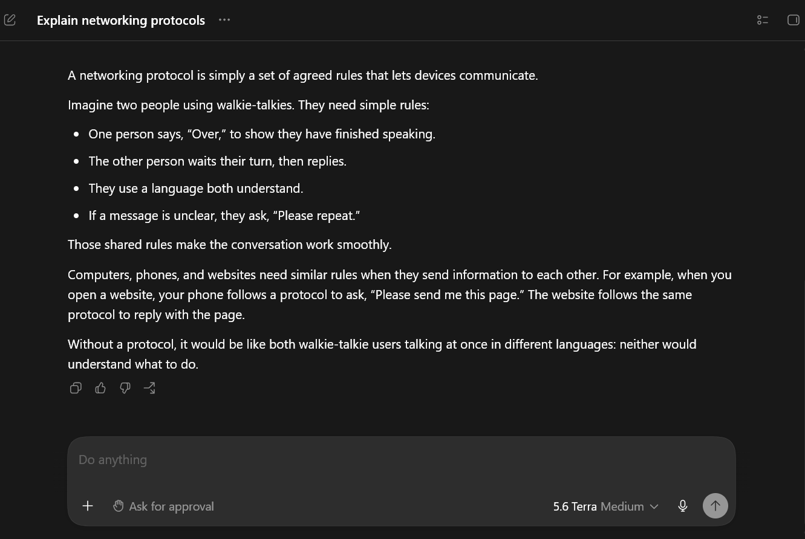
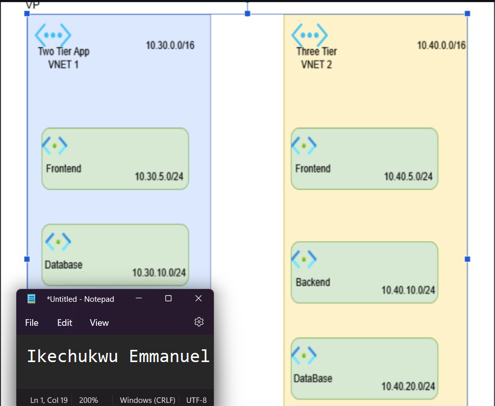
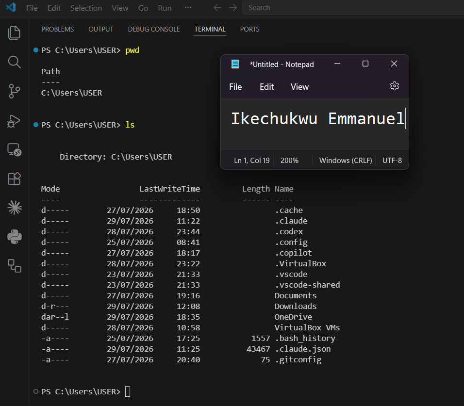

# Week 00 - Internet and Networking

Part of the DevOps Micro Internship (DMI) Cohort 3 with Agentic AI

---

# 🧑‍💻 Task 1: Using ChatGPT as Your Learning Assistant

## Scenario

You're new to DevOps and will frequently encounter technical questions. ChatGPT can be your learning companion.

## Your Task

Write a clear ChatGPT prompt to help you understand:

> "What is a protocol in networking? Explain with a simple real-life example."

Take a screenshot of your interaction showing:

* Your detailed prompt (with clear expectations)
* ChatGPT's simplified response with an example

## Screenshot

Save your screenshot in the `screenshots` folder and update the file name below.




Replace `task-1-chatgpt.png` with your actual screenshot file name.

---

## What I Learned (2–3 lines)

I learned that a networking protocol is a set of rules that allows devices to communicate with each other over a network. The real-life example helped me understand that protocols are like rules people follow during a conversation to avoid confusion.

# 🌐 Task 2: Internet and Networking

## Scenario

Your friend is launching an online bookstore named **EpicReads**.

He asked you to explain how users globally can access his website hosted in Finland.

## Your Task

Write a short explanation (**100–150 words**) that includes:

* Packet Switching
* IP Address
* TCP/IP
* HTTP/HTTPS

💡 **Tip:** You may use ChatGPT (as demonstrated in Task 1) to refine your explanation.

## Answer

When someone visits EpicReads from anywhere in the world, their request is broken into small pieces called packets through packet switching. These packets travel across different networks to reach the web server hosted in Finland. Every device connected to the internet has a unique IP address, which helps the packets find the correct destination. TCP/IP ensures that all packets arrive correctly, in the right order, and without missing data. Once the request reaches the server, HTTP or HTTPS is used to transfer the website's content back to the user's browser. HTTPS is more secure because it encrypts the communication, protecting users' personal information and making online browsing safer.

# 🏗️ Task 3: Application Architecture & Stack

## Scenario

EpicReads bookstore has two application versions:

### Two-Tier Application

* Frontend
* Database

### Three-Tier Application

* Frontend
* Backend
* Database

## Your Task

* Draw simple diagrams (hand-drawn or tool-based such as draw.io)
* Label each layer clearly
* List at least two common technologies or tools used for each layer
* Submit a screenshot or photo clearly showing your own drawing

## Diagram Screenshot / Photo

Save your diagram image in the `screenshots` folder and update the file name below.

 


Replace `task-3-diagram.png` with your actual diagram file name.

---

## Technologies Used

### Frontend

* HTML, CSS, JavaScript
* React

### Backend

* Node.js
* Express.js

### Database

* MySQL
* PostgreSQL

---

# 🌍 Task 4: Domain Name & DNS (Basic Concepts)

## Scenario

Your friend's bookstore **EpicReads** is currently accessible through:

```text
52.172.142.222:3000
```

He purchased the domain:

```text
epicreads.com
```

## Your Task

In **50–100 words**, explain in your own words:

1. What is DNS (Domain Name System)?
2. Which DNS record type should be used to connect the domain to the given IP, and why?

## Answer

DNS (Domain Name System) translates human-readable domain names such as epicreads.com into IP addresses that computers use to locate websites. Instead of remembering an IP address, users can simply type the domain name into their browser. To connect epicreads.com to the IP address 52.172.142.222, an A record should be used because it maps a domain name directly to an IPv4 address.

---

# 💻 Task 5: Visual Studio Code Setup (Hands-on)

## Your Task

Install Visual Studio Code (if not already installed).

Take a screenshot of your VS Code environment showing:

* Terminal open inside VS Code
* Running a basic command:

### Windows

```powershell
dir
```

### Linux / macOS

```bash
pwd
ls
```

* Your selected VS Code theme clearly visible

⚠️ **Important:** The screenshot must show your username or another identifiable detail to confirm it is your environment.

## Screenshot

Save your screenshot in the `screenshots` folder and update the file name below.

 

Replace `task-5-vscode.png` with your actual screenshot file name.

---

# 🔗 Task 6: Publish Your Assignment as a LinkedIn Post

## Objective

Publishing on LinkedIn helps you:

* Build your professional online presence
* Reinforce your learning
* Document your DevOps journey publicly

## Your Task

Summarize your answers from Tasks 1–5 into a LinkedIn post.

Clearly structure your post into the following sections:

* ChatGPT
* Internet & Networking
* App Architecture
* DNS
* VS Code Setup

Add the following credit note at the end of your post:

> **P.S. This post is part of the DevOps Micro Internship (DMI) with Agentic AI — Cohort 3 — by Pravin Mishra. My graded progress is public: https://dmi.pravinmishra.com/s/YOUR-GITHUB-USERNAME.html · Start your DevOps journey: https://dmi.pravinmishra.com/?utm_source=student&utm_medium=ps-linkedin&utm_campaign=cohort3**

---

## LinkedIn Post URL

Paste your LinkedIn post URL here:

https://www.linkedin.com/posts/ikechukwu-emmanuel_epic-reads-shop-young-adult-ya-books-activity-7443334553328365568-5hp-

## LinkedIn Post Backup Copy

Paste the full text of your LinkedIn post here:

1. A protocol in networking is a set of rules that devices follow so they can communicate with each other correctly. Imagine two people talking on the phone,They agree to speak the same language (English)
	They take turns speaking (one talks, the other listens)
They say “Hello” to start and “Goodbye” to end
	They ask again if they didn’t hear clearly

2. In computer networking, packet switching is the method used to send data by breaking it into small pieces called packets. Each packet travels independently across the network and is reassembled at the destination. To ensure packets reach the correct device, every device on a network is assigned an IP address, which works like a digital home address. Communication on the internet relies on the TCP/IP model: TCP (Transmission Control Protocol) ensures data is delivered accurately and in order, while IP (Internet Protocol) handles addressing and routing. When you browse the web, your browser uses HTTP (Hypertext Transfer Protocol) to request and receive web pages. HTTPS is the secure version of HTTP; it encrypts data to protect sensitive information such as passwords and personal details. Together, these technologies make reliable and secure internet communication possible.

3. DNS (Domain Name System) is like the internet’s phonebook. It translates human-friendly domain names like epicreads.com into machine-readable IP addresses such as 52.172.142.222 so browsers can find the correct server.

To connect the domain to that IP, an A record should be used. An A record maps a domain name directly to an IPv4 address. Since 52.172.142.222 is an IPv4 address, the A record ensures that when someone visits epicreads.com, they are directed to the correct server running the bookstore website on port 3000.

# Reflection – Week 0

### What did you find easy?

Understanding the basic networking concepts and using ChatGPT to learn technical topics in a simple way.

### What was difficult?

Creating and understanding application architecture diagrams was slightly challenging at first, but it became easier after practising.

### What will you improve next week?

I will spend more time practising networking concepts and Linux commands so I can build a stronger foundation for future DevOps tasks.

## 📌 About DMI & CloudAdvisory

DevOps Micro Internship (DMI) is a project-based DevOps program run by Pravin Mishra (The CloudAdvisory) focused on real-world execution, systems thinking, and career readiness.

It helps learners build strong DevOps foundations with hands-on experience.


## 📌 Resources

- 🌐 **DMI Official Website:** https://dmi.pravinmishra.com?utm_source=github&utm_medium=readme  
- 🎓 **University:** https://university.pravinmishra.com?utm_source=github&utm_medium=readme  
- 💬 **Discord Community:** https://discord.pravinmishra.com?utm_source=github&utm_medium=readme  
- 📝 **Blog:** https://dmi.pravinmishra.com/blog?utm_source=github&utm_medium=readme  
- ▶️ **YouTube Playlist (DMI Cohort 3):** https://www.youtube.com/playlist?list=PLFeSNDtI4Cho  
- 🔗 **Pravin Mishra (LinkedIn):** https://www.linkedin.com/in/pravin-mishra-aws-trainer/  
- 🏢 **CloudAdvisory (LinkedIn):** https://www.linkedin.com/company/thecloudadvisory/

---

*This submission is part of DevOps Micro Internship (DMI) Cohort 3 — Agentic AI Track*