# Assignment 3 — Production Maintenance Drill (OPS Checklist)

Part of the DevOps Micro Internship (DMI) Cohort 3 with Agentic AI

---

## Purpose

In this assignment, you will treat your already deployed React application (on Ubuntu VM with Nginx) as a live production system. You will perform structured operational checks covering network validation, service health, log analysis, resource monitoring, configuration verification, and incident simulation with recovery — mirroring real on-call DevOps responsibilities.

---

# Task 1 — Server Access & Networking Validation

## Goal

Verify that the deployed React application is reachable from the browser and confirm basic network connectivity of the Ubuntu VM.

### Evidence

#### Screenshot 1 — Browser showing the React app with your Full Name visible on the UI

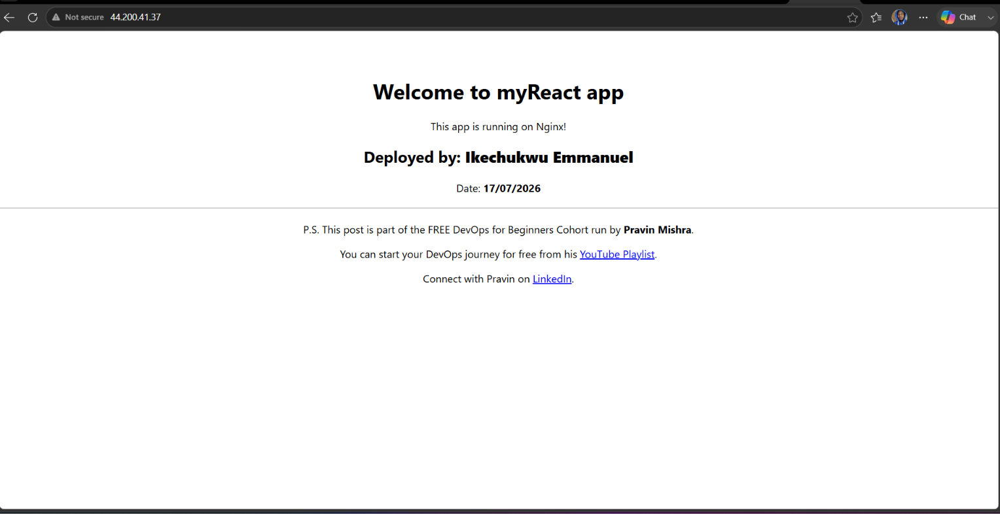

---

#### Screenshot 2 — Output of `ip a`

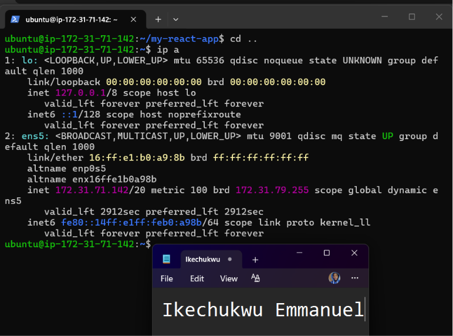

---

#### Screenshot 3 — Output of `sudo ss -tulpen`

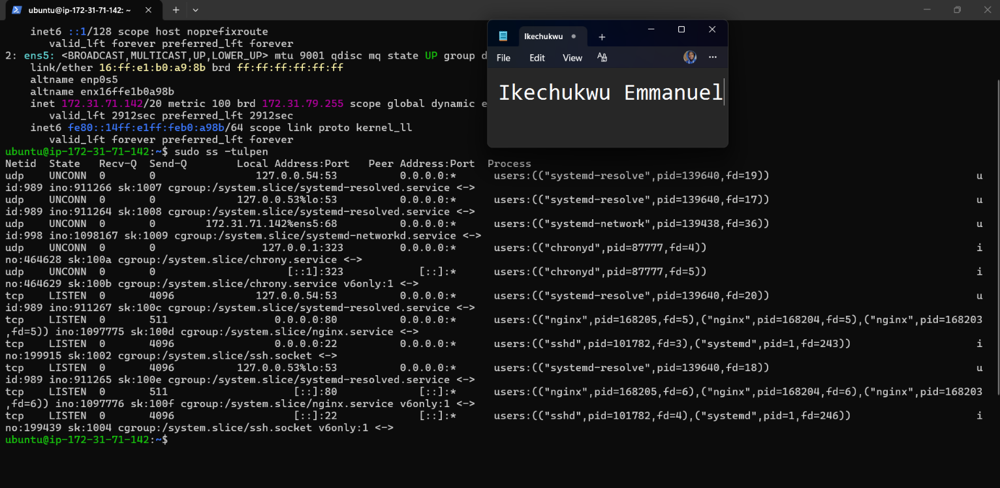

---

#### Screenshot 4 — Output of `sudo ufw status`

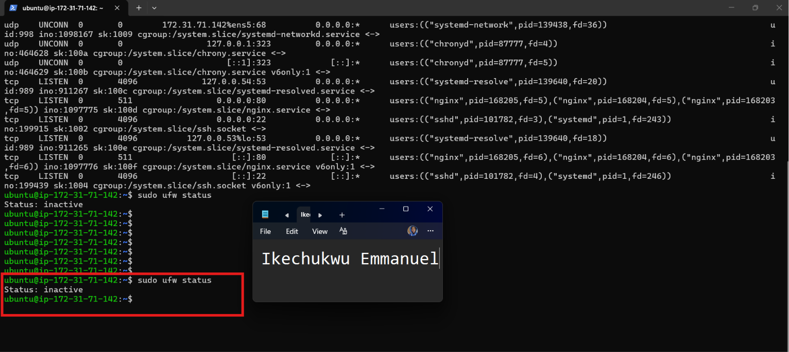

---

### Notes

Answer the following in your own words:

**1. What proves Nginx is listening on 0.0.0.0:80?**

The output of sudo ss -tulpen shows Nginx listening on port 80. The 0.0.0.0:80 address means Nginx is listening for HTTP connections on port 80 from all IPv4 network interfaces.

---

**2. What proves SSH is active on port 22?**

The output of sudo ss -tulpen shows SSH (sshd) listening on port 22. This proves that the server is accepting SSH connections through port 22.

---

**3. Did you find any unexpected open ports? Explain briefly.**

No, I did not find any unexpected open ports. The open ports I observed were related to the services running on the server, such as SSH on port 22 and HTTP through Nginx on port 80.

---

# Task 2 — Service Health & Systemd Validation (Nginx)

## Goal

Verify that Nginx is properly installed, running, enabled at boot, and safely configured.

### Evidence

#### Screenshot 1 — Output of `systemctl status nginx --no-pager`

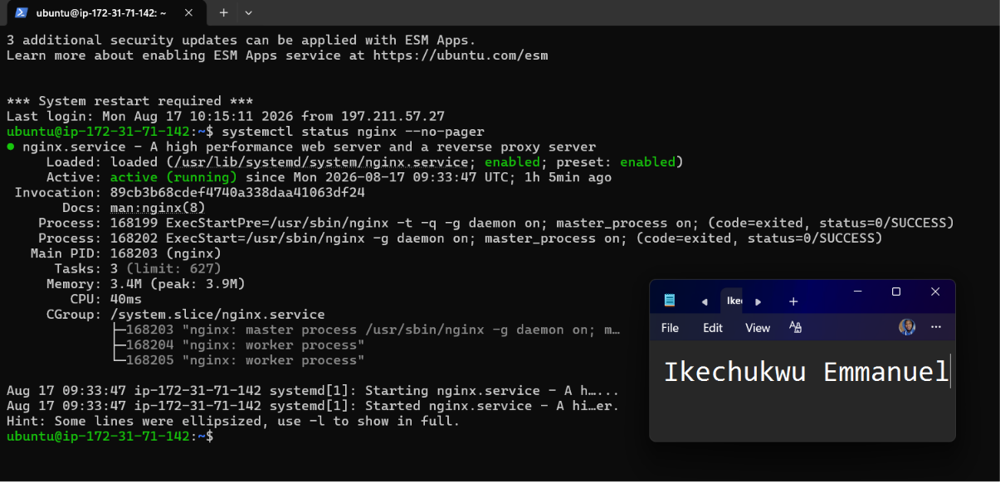

---

#### Screenshot 2 — Output of `sudo nginx -t`

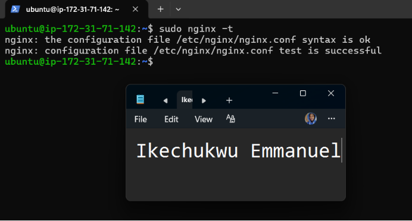

---

#### Screenshot 3 — Output of `sudo ss -lptn '( sport = :80 )'`

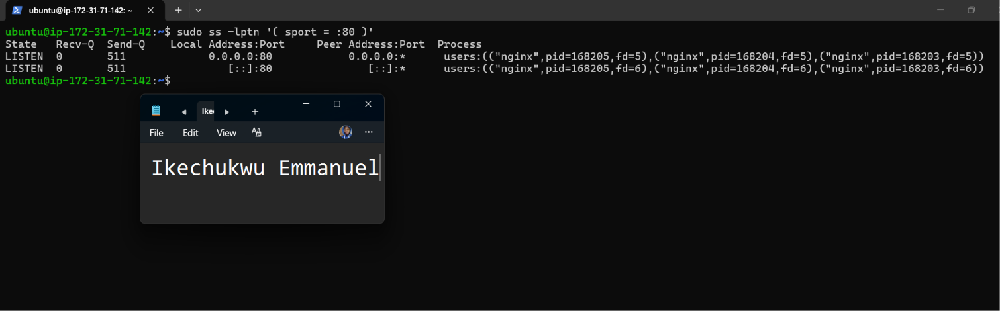

---

### Notes

Answer the following in your own words:

**1. What happens if Nginx fails to restart in production?**

If Nginx fails to restart, the website may become unavailable, and any new configuration changes will not take effect. Users may be unable to access the application until the problem is fixed.

---

**2. What's your basic rollback plan?**

My basic rollback plan is to restore the last known working Nginx configuration, test it with sudo nginx -t, and then restart Nginx. I would also check the Nginx logs to confirm that the service is working correctly after the rollback.

---

# Task 3 — Logs & Request Trace

## Goal

Verify real traffic flow and analyze logs to understand system behavior and errors.

### Evidence

#### Screenshot 1 — Output of `sudo tail -n 30 /var/log/nginx/access.log`

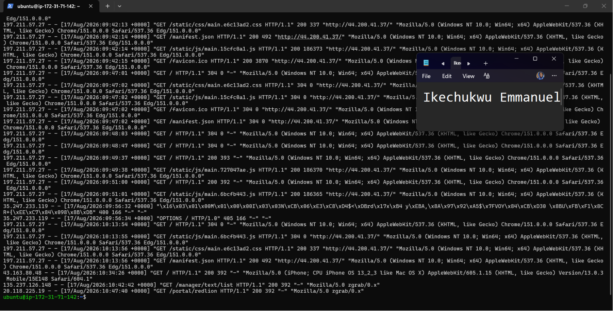

---

#### Screenshot 2 — Output of `sudo tail -n 30 /var/log/nginx/error.log`

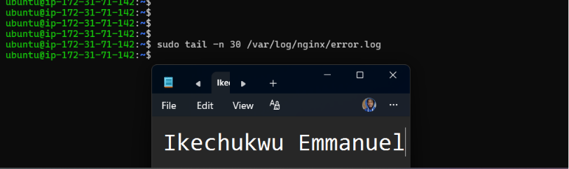

---

#### Screenshot 3 — Output of `sudo journalctl -u nginx --no-pager -n 50`

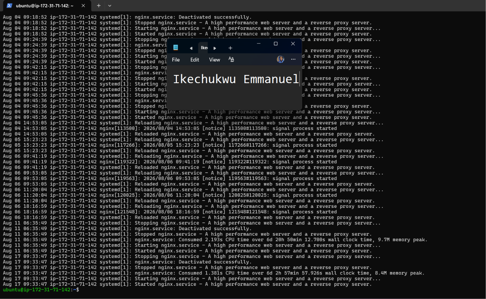

---

### Notes

Answer the following in your own words:

**1. Were there any errors in the logs?**

- If yes, mention 1–2 example error lines from the logs and explain what each one means in simple terms.
- If no, explain what it means if the error log is empty or shows no recent errors during your check.

No recent errors were found in the Nginx error log. The error.log command returned no output, while the journalctl output showed successful Nginx stops, starts, and reloads. There were no recent messages indicating a failed Nginx service.

---

**2. If there were no errors, what does that indicate about the system?**

It indicates that Nginx is currently operating normally and there are no recent configuration or service errors being reported. The successful reload and start messages also show that Nginx is able to start and reload its configuration correctly.

---

**3. Based on the access logs, were your curl requests visible in the log entries? What does that prove about traffic flow?**

Yes. The curl requests appeared in the Nginx access log as HTTP requests to the server. This proves that traffic from the client reached the EC2 instance and was received and processed by Nginx.

---

# Task 4 — System Resource Health Check (Capacity Red Flags)

## Goal

Assess server capacity and detect potential performance or failure risks.

### Evidence

#### Screenshot 1 — Output of `uptime`

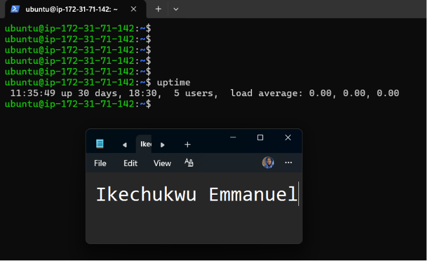

---

#### Screenshot 2 — Output of `free -h`

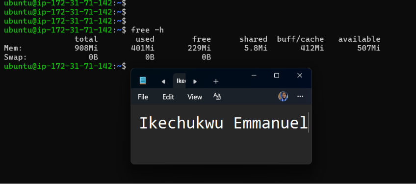

---

#### Screenshot 3 — Output of `df -h`

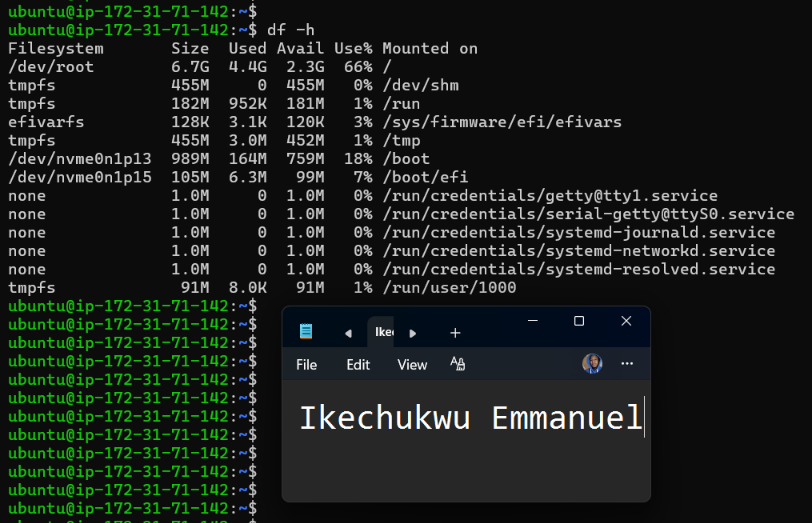

---

#### Screenshot 4 — Output of `sudo du -sh /var/* | sort -h`

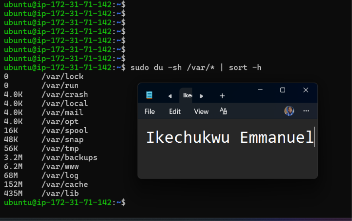

---

### Notes

Answer the following in your own words:

**1. Which resource looks most critical right now? (CPU/load, memory, or disk) Explain why.**

The resource that appears most critical is memory, because the server is running with limited RAM and the available memory should be monitored closely. High memory usage can cause applications and services to slow down or become unstable. CPU load and disk usage should also be monitored, but memory is the main resource of concern on this small server.

---

**2. What happens if disk becomes 100% full in a production server?**

If the disk becomes 100% full, the server may no longer be able to write files, logs, temporary data, or other required information. This can cause applications and services such as Nginx to malfunction, prevent deployments or updates, and potentially make the system unstable. Therefore, disk usage should be monitored and unnecessary files or logs should be cleaned up before the disk reaches full capacity.

---

# Task 5 — Configuration & Deployment Verification

## Goal

Ensure the correct React build is deployed and Nginx is serving it properly.

### Evidence

#### Screenshot 1 — Output of `ls -lah /var/www/html | head -n 20`

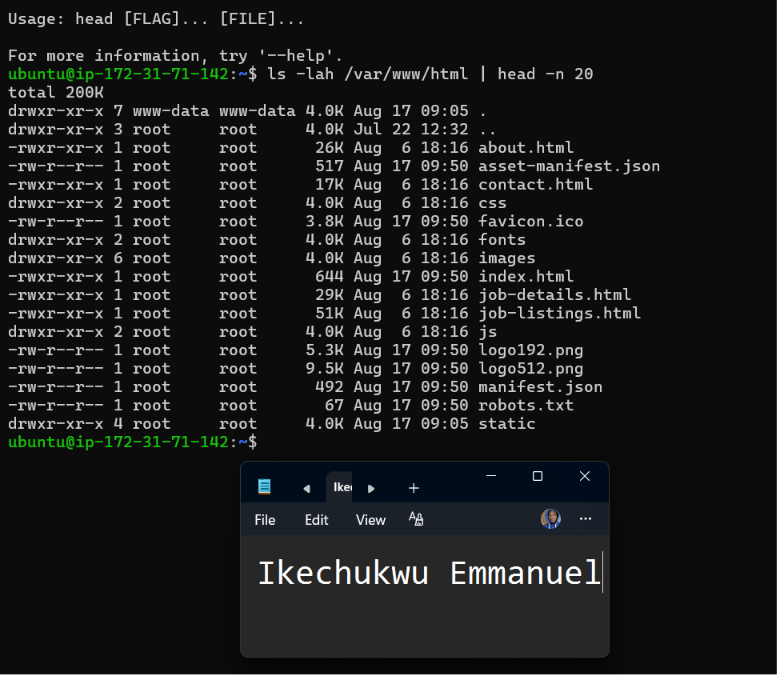

---

#### Screenshot 2 — Output of `grep -R "Deployed by" -n /var/www/html 2>/dev/null | head`

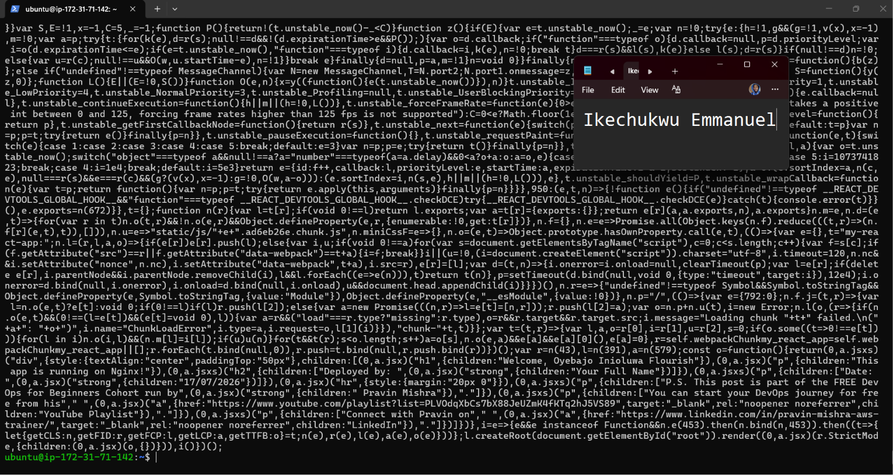

---

#### Screenshot 3 — Output of `grep -n "try_files" /etc/nginx/sites-available/default`

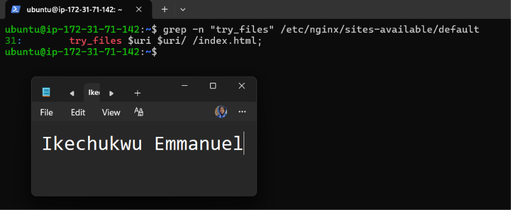

---

### Notes

Answer the following in your own words:

**1. How do you confirm that the correct version of the application is deployed?**

I can confirm that the correct version of the application is deployed by checking the files in /var/www/html, verifying the deployment information in the application files, and checking that the Nginx configuration points to the correct web root. I can also open the application in a browser and confirm that the expected application content, including my name and date, is displayed.

---

# Task 6 — Nginx Configuration Failure Simulation

## Goal

Simulate a real-world Nginx misconfiguration and recover the service safely.

### Evidence

#### Screenshot 1 — Output of `sudo nginx -t` showing the syntax error (broken config)

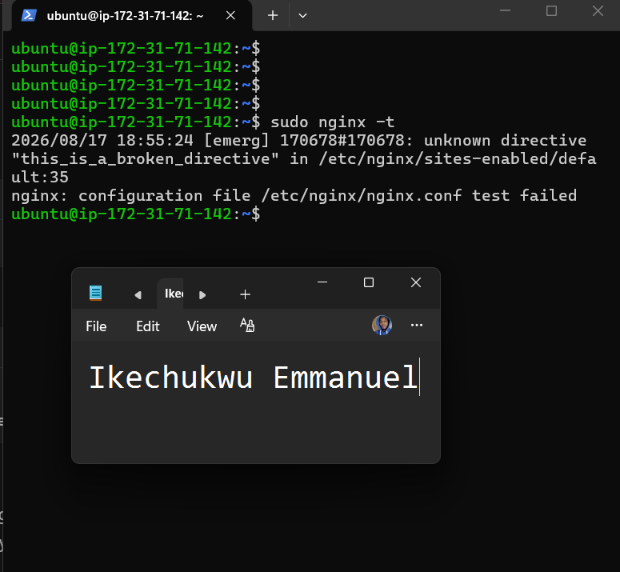

---

#### Screenshot 2 — Output of `sudo nginx -t` showing syntax ok (fixed config)

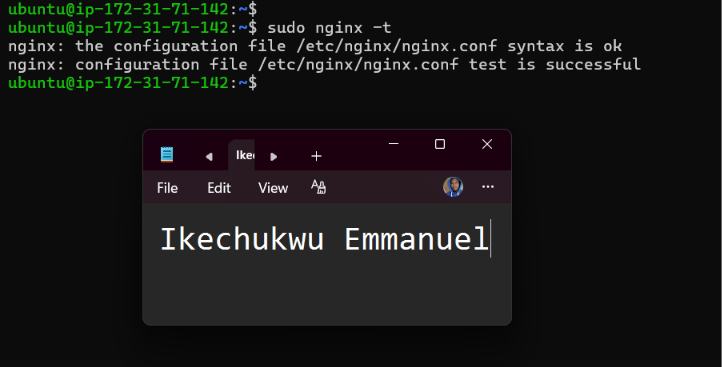

---

#### Screenshot 3 — Output of `curl -I http://<public-ip>` confirming recovery (200 OK)

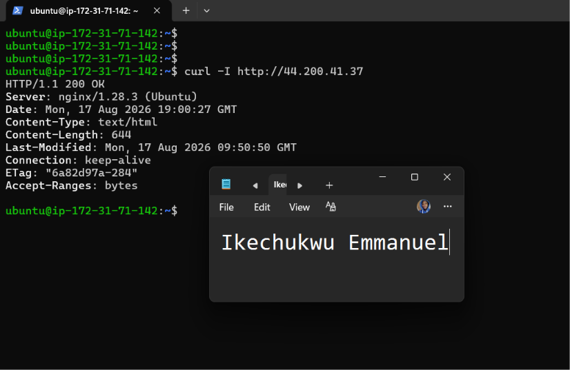

---

### Notes

Answer the following in your own words:

**1. What caused the configuration failure?**

The configuration failure was caused by adding an invalid directive to the Nginx configuration file. When I ran sudo nginx -t, Nginx detected the invalid directive and reported a syntax error.

---

**2. How did you fix the issue?**

I removed the invalid directive from the Nginx configuration file and ran sudo nginx -t again. The test then showed that the syntax was okay and the configuration test was successful. I then verified that the application was responding normally with curl.

---

**3. How can you avoid this kind of issue in real production systems?**

I can avoid this type of issue by testing Nginx configurations with sudo nginx -t before applying changes, keeping backups of known-working configurations, making changes carefully, and using version control or a proper deployment process. This allows configuration problems to be detected before they affect users.

---

# Task 7 — Web Application Failure Simulation

## Goal

Simulate missing deployment content and recover the application safely.

### Evidence

#### Screenshot 1 — Output of `curl -I http://<public-ip>` showing failure (non-200 response)

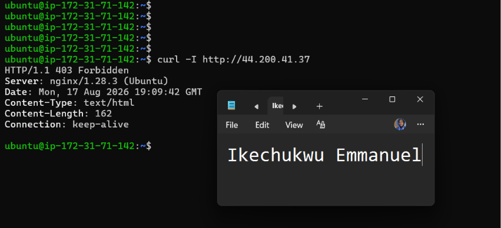

---

#### Screenshot 2 — Output of `curl -I http://<public-ip>` confirming recovery (200 OK)

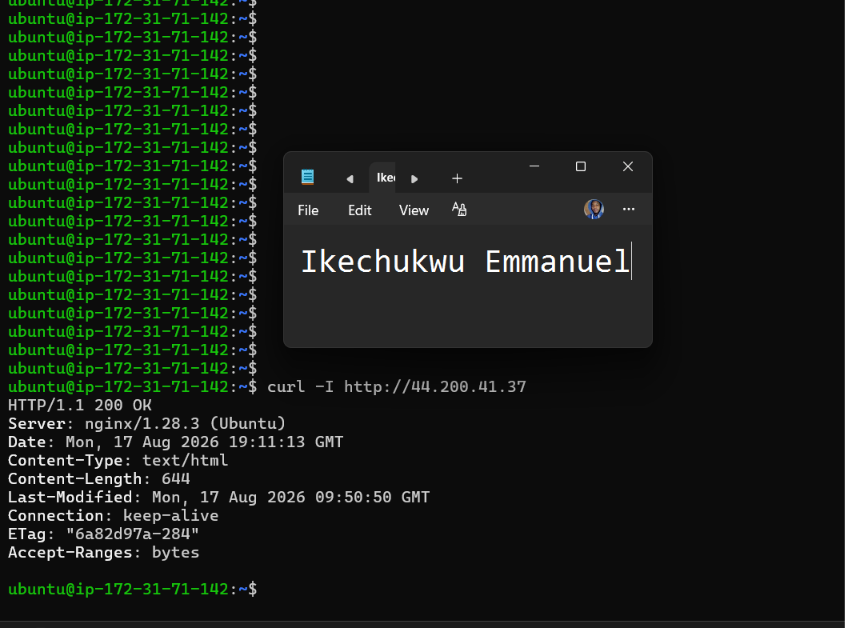

---

### Notes

Answer the following in your own words:

**1. What caused the application to break in this scenario?**

The application broke because the index.html file was temporarily moved out of the Nginx web root directory /var/www/html. Since Nginx could no longer find the main application file, the server returned a non-200 HTTP response.

---

**2. How did you fix the issue and restore the application?**

I restored the index.html file to /var/www/html and then tested the application using curl -I http://44.200.41.37. The server returned 200 OK, confirming that the application was accessible again.

---

**3. What steps would you take to prevent this kind of issue in real production systems?**

I would use proper deployment procedures, keep backups of important application files, use version control, monitor the application for failures, and avoid manually deleting or moving production files. I would also use automated deployment and rollback processes so that a previous working version can be restored quickly if a deployment fails.

---

# Task 8 — Security & Reliability Review

## Goal

Review and reflect on the security and reliability practices applied during this assignment.

### Security & Reliability Notes

Answer the following in your own words:

**1. Why is SSH key-based authentication more secure than sharing passwords?**

SSH key-based authentication is more secure because it uses a private key and a public key instead of relying on a password that can be guessed, stolen, or reused. The private key remains on the user's device and should never be shared publicly.

---

**2. Why should only required ports be open on a production server?**

Only required ports should be open to reduce the server's attack surface. Every unnecessary open port can provide another possible entry point for attackers. For example, a web server normally needs port 80 for HTTP and port 22 for SSH administration.

---

**3. Why is it important for Nginx to be enabled on boot?**

Enabling Nginx on boot ensures that the web server automatically starts when the server restarts. Without it, the server could come back online but the website would remain unavailable until Nginx is manually started.

---

**4. What are the risks of sharing secrets, keys, or credentials publicly?**

Sharing secrets, private keys, passwords, or credentials publicly can allow unauthorized people to access cloud resources, servers, applications, or personal information. This can lead to data loss, security breaches, unauthorized changes, and unexpected cloud charges. Private keys and credentials should always be kept secret.

---

**5. Why should cloud resources be stopped or terminated when they are no longer needed?**

Unused cloud resources should be stopped or terminated to avoid unnecessary costs and reduce security risks. Resources that are left running can continue generating charges and may also remain exposed to potential attacks. Cleaning up unused resources helps control both cost and security.

---

# LinkedIn Post (Required)

## Evidence

#### LinkedIn Post URL

Paste your LinkedIn post URL here:

`https://www.linkedin.com/posts/ikechukwu-emmanuel_devops-aws-cloudcomputing-activity-7495200003179749376-hvLa?utm_source=social_share_send&utm_medium=member_desktop_web&rcm=ACoAAGENBPUBsLYqmgeLRkF6HTid7rCysjW2i7w`

---

#### Screenshot — Published LinkedIn post

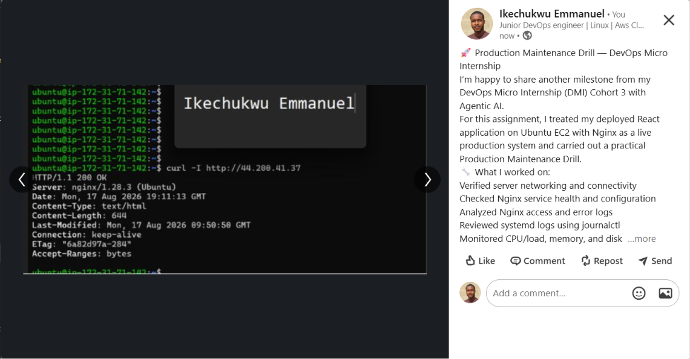  

---

# Submission Instructions

- Add all required screenshots in your submission
- Full name must be visible in required screenshots
- Do not expose sensitive information (keys, passwords, account IDs)

---

# Completion Checklist

- [ ] Task 1: Screenshots (browser, ip a, ss -tulpen, ufw status) + Notes answered
- [ ] Task 2: Screenshots (nginx status, nginx -t, ss port 80) + Notes answered
- [ ] Task 3: Screenshots (access log, error log, journalctl) + Notes answered
- [ ] Task 4: Screenshots (uptime, free -h, df -h, du -sh) + Notes answered
- [ ] Task 5: Screenshots (ls html, grep deployed by, grep try_files) + Notes answered
- [ ] Task 6: Screenshots (nginx -t fail, nginx -t pass, curl recovery) + Notes answered
- [ ] Task 7: Screenshots (curl failure, curl recovery) + Notes answered
- [ ] Task 8: Security & Reliability Notes answered
- [ ] LinkedIn post published and URL submitted
- [ ] Full Name visible in all required screenshots
- [ ] No sensitive data exposed

---

## 📌 About DMI & CloudAdvisory

DevOps Micro Internship (DMI) is a project-based DevOps program run by Pravin Mishra (The CloudAdvisory) focused on real-world execution, systems thinking, and career readiness.

It helps learners build strong DevOps foundations with hands-on experience.

---

## 📌 Resources

- 🌐 DMI Official Website: https://dmi.pravinmishra.com?utm_source=github&utm_medium=readme  
- 🎓 University: https://university.pravinmishra.com?utm_source=github&utm_medium=readme  
- 💬 Discord Community: https://discord.pravinmishra.com?utm_source=github&utm_medium=readme  
- 📝 Blog: https://dmi.pravinmishra.com/blog?utm_source=github&utm_medium=readme  
- ▶️ YouTube Playlist: https://www.youtube.com/playlist?list=PLFeSNDtI4Cho  
- 🔗 Pravin Mishra (LinkedIn): https://www.linkedin.com/in/pravin-mishra-aws-trainer/  
- 🏢 CloudAdvisory (LinkedIn): https://www.linkedin.com/company/thecloudadvisory/

---

*This submission is part of DevOps Micro Internship (DMI) Cohort 3 — Agentic AI Track.*