# Assignment 5 — Bash Script Automation Drill (OPS Checklist)

Part of the DevOps Micro Internship (DMI) Cohort 3 with Agentic AI

---

## Purpose

In this assignment, you will practice Bash scripting by building a series of small automation scripts covering environment setup, variables, arrays, loops, file conditionals, if-else logic, and functions. These scripts form the foundation of real-world Linux automation used in DevOps, cloud, and production support environments.

---

# Task 1 — Bash Environment & Workspace Setup

## Goal

Verify that Bash is available on your system and create a clean workspace for this assignment.

### Evidence

#### Screenshot 1 — Output of `echo $SHELL` and `bash --version`

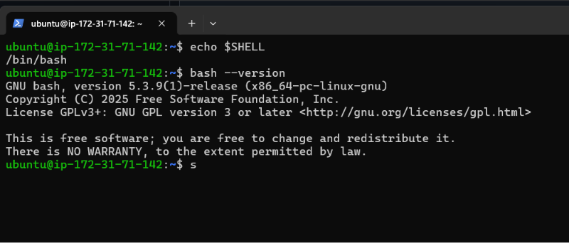

---

#### Screenshot 2 — Output of `pwd` and `ls -lah` showing the scripts directory

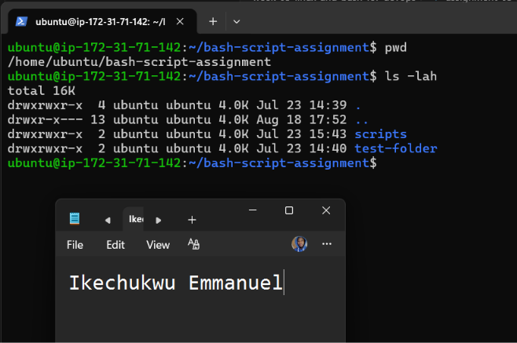

---

### Notes

Answer the following in your own words:

**1. What is Bash?**

Bash (Bourne Again SHell) is a command-line shell used to interact with Linux and other Unix-like operating systems. It allows users to run commands, manage files and directories, and create scripts to automate tasks.

---

**2. What is the difference between shell and Bash?**

A shell is a general program that provides an interface for interacting with an operating system through commands. Bash is one specific type of shell. Other examples of shells include Zsh, Fish, and Dash. Bash also provides scripting features such as variables, loops, conditionals, and functions

---

**3. Why is it important to confirm the Bash version before writing scripts?**

Checking the Bash version helps confirm which features and syntax are supported on the system. This reduces compatibility problems and makes sure the scripts we write will behave as expected in the current environment.

---

# Task 2 — Your First Bash Script

## Goal

Create your first Bash script, make it executable, and run it from the terminal.

### Evidence

#### Screenshot 1 — Content of `first-script.sh`

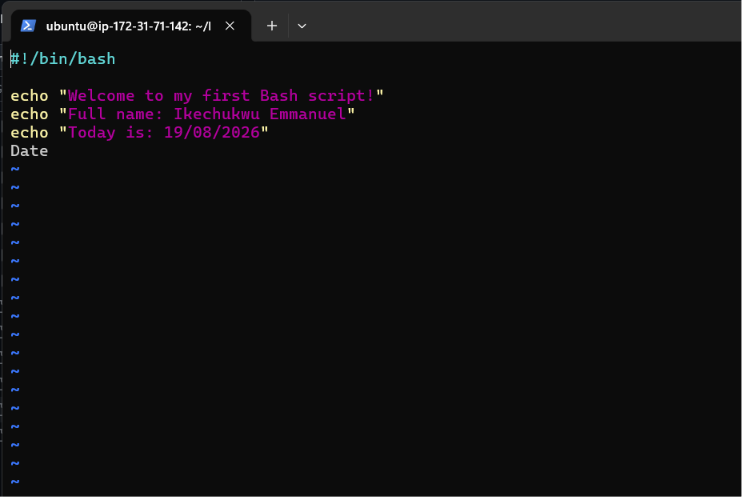

---

#### Screenshot 2 — Output of `./first-script.sh`

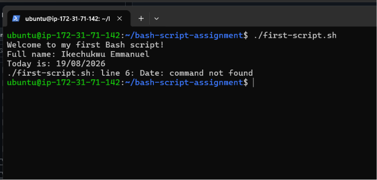

---

#### Screenshot 3 — Output of `ls -l first-script.sh` showing executable permission

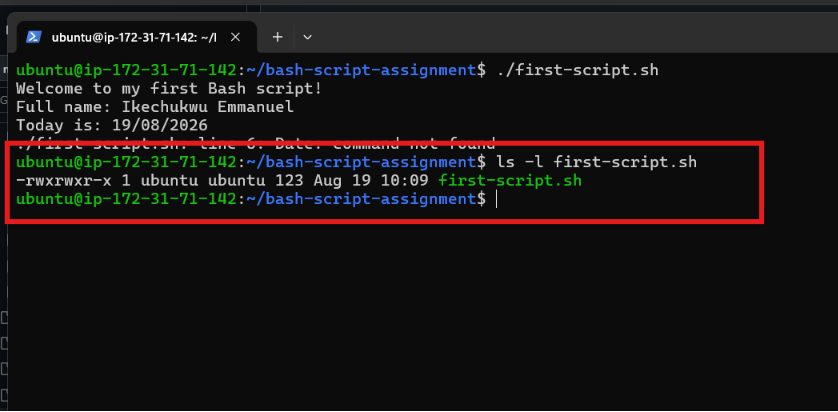

---

### Notes

Answer the following in your own words:

**1. What is the purpose of `#!/bin/bash`?**

#!/bin/bash is called a shebang. It tells the operating system to use the Bash interpreter to execute the script.

---

**2. Why do we use `chmod +x` before running a script?**

chmod +x gives the script execute permission. This allows us to run the script directly using ./first-script.sh.

---

**3. What is the difference between running a script using `./script.sh` and `bash script.sh`?**

./script.sh runs the script directly using the interpreter specified by its shebang, such as #!/bin/bash, and therefore requires execute permission. bash script.sh explicitly tells Bash to run the script, so the script itself does not need execute permission.

---

# Task 3 — Variables: User Information Script

## Goal

Use variables to store and display user-related information.

### Evidence

#### Screenshot 1 — Content of `user-info.sh`

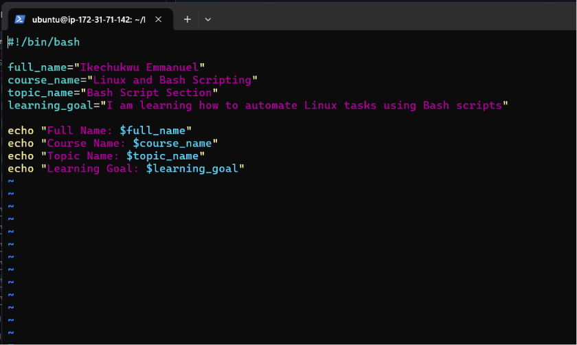

---

#### Screenshot 2 — Output of `./user-info.sh`

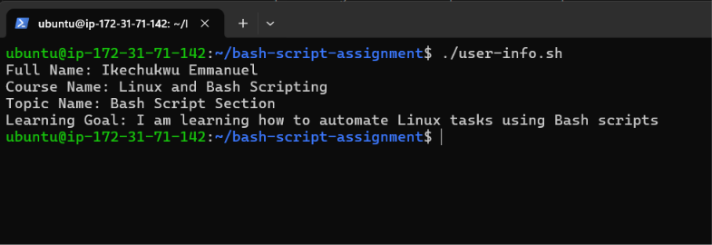

---

### Notes

Answer the following in your own words:

**1. What is a variable in Bash?**

A variable in Bash is a named storage location used to hold a value such as text, numbers, or other information. Variables make scripts easier to manage because the stored values can be reused in different parts of the script.

---

**2. Why should we avoid spaces around the `=` sign when creating variables?**

Bash does not allow spaces around the = sign when assigning a value to a variable. For example, full_name="My Name" is correct, while full_name = "My Name" is interpreted as a command and will cause an error.

---

**3. How do you access the value stored inside a Bash variable?**

We access the value of a Bash variable by placing a "$" before the variable name. For example, if we create full_name="My Name", we can display its value using "$full_name".

---

# Task 4 — Arrays & Loops: Tools Checklist Script

## Goal

Use arrays and loops to print a checklist of tools used in Bash scripting.

### Evidence

#### Screenshot 1 — Content of `tools-checklist.sh`

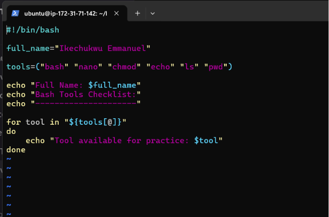

---

#### Screenshot 2 — Output of `./tools-checklist.sh`

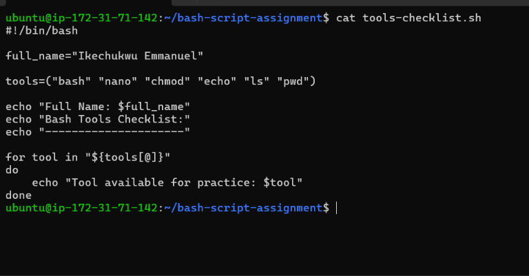

---

### Notes

Answer the following in your own words:

**1. What is an array in Bash?**

An array in Bash is a variable that can store multiple values under one name. In this script, the tools array stores several Bash tools such as bash, nano, chmod, echo, ls, and pwd.

---

**2. Why are arrays useful in scripts?**

Arrays are useful because they allow us to store and manage multiple related values together. This makes scripts easier to organize and allows us to process many items using loops instead of writing separate commands for each item.

---

**3. What does `"${tools[@]}"` mean?**

"${tools[@]}" means all the individual elements stored in the tools array. It allows the for loop to process each tool separately.

---

**4. What is the purpose of the `for` loop in this script?**

The for loop goes through each item in the tools array one at a time and prints it. This avoids having to write a separate echo command for every tool and demonstrates how loops can automate repetitive tasks.

---

# Task 5 — Loops: Number Counter Script

## Goal

Use loops to repeat a task multiple times.

### Evidence

#### Screenshot 1 — Content of `counter.sh`

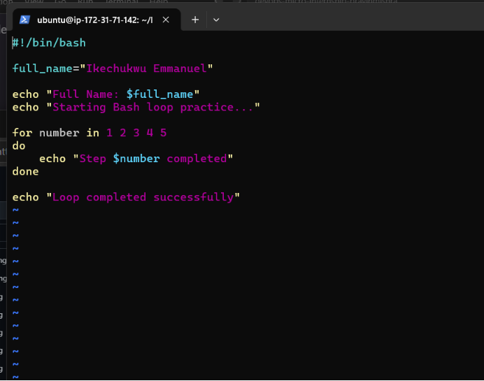

---

#### Screenshot 2 — Output of `./counter.sh`

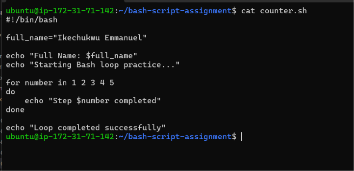

---

### Notes

Answer the following in your own words:

**1. What is a loop?**

A loop is a programming structure that repeats a set of commands multiple times. In Bash, loops can be used to process a list of items or repeat an operation until a specific condition is met.

---

**2. Why do we use loops in Bash scripting?**

We use loops to automate repetitive tasks. Instead of writing the same command many times, we can write it once inside a loop and let Bash repeat it as many times as required.

---

**3. How many times did the loop run in your script?**

The loop ran 5 times, once for each number from 1 to 5.

---

**4. What would you change if you wanted the loop to run 10 times?**

I would change the range from {1..5} to {1..10}. This would make the loop run 10 times, counting from 1 through 10.

---

# Task 6 — Files & Conditionals: File Validation Script

## Goal

Use file checks and conditionals to verify whether files and directories exist.

### Evidence

#### Screenshot 1 — Output of `ls -lah ../test-folder`

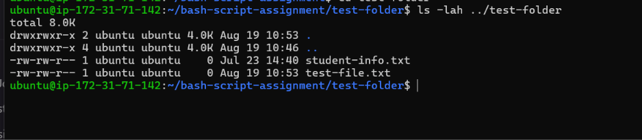

---

#### Screenshot 2 — Content of `file-check.sh`

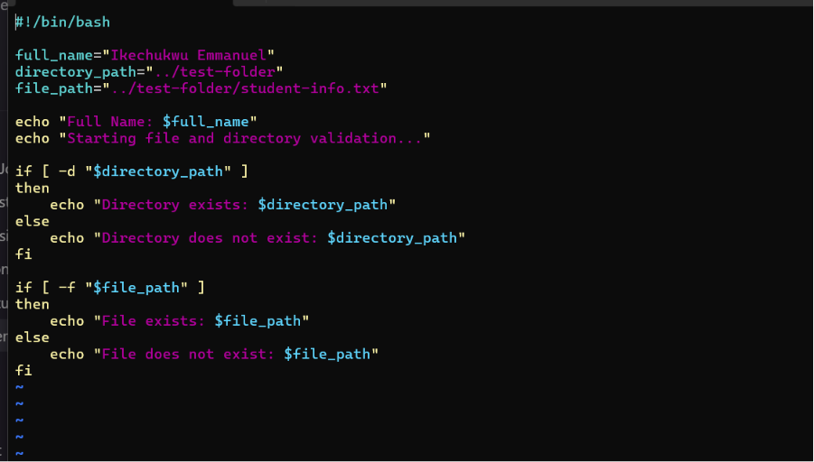

---

#### Screenshot 3 — Output of `./file-check.sh`

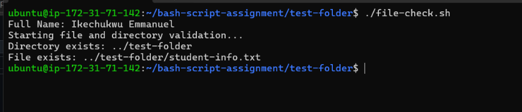

---

### Notes

Answer the following in your own words:

**1. What does `-d` check in Bash?**

The -d condition checks whether a specified path exists and is a directory. In this script, it checks whether the ../test-folder directory exists.

---

**2. What does `-f` check in Bash?**

The -f condition checks whether a specified path exists and is a regular file. In this script, it checks whether ../test-folder/student-info.txt exists as a file.

---

**3. Why should file and directory paths be stored in variables?**

Storing paths in variables makes a script easier to read, maintain, and modify. If the location changes, we only need to update the variable instead of changing the path everywhere in the script.

---

**4. What happens if the file does not exist?**

If the file does not exist, the -f condition becomes false, so the script executes the else section and displays a message saying that the file does not exist. The script itself does not stop or crash because it handles the situation with an if-else condition.

---

# Task 7 — Conditionals: Pass or Retry Script

## Goal

Use if-else conditionals to make decisions based on a variable value.

### Evidence

#### Screenshot 1 — Content of `score-check.sh` with `score=85`

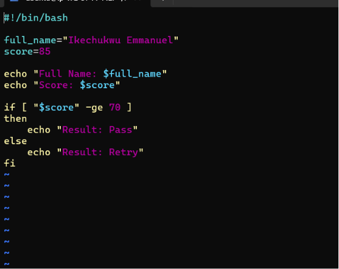

---

#### Screenshot 2 — Output showing `Result: Pass`

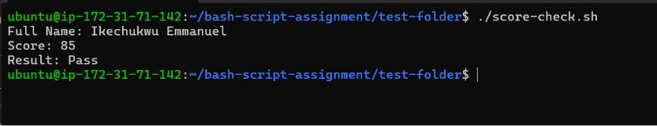

---

#### Screenshot 3 — Content of `score-check.sh` with `score=55`

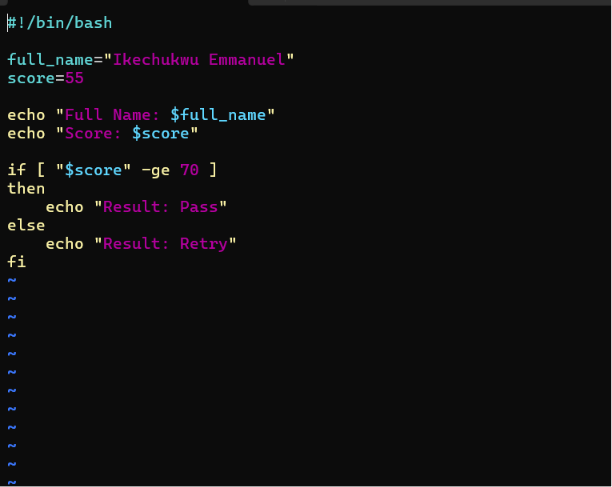

---

#### Screenshot 4 — Output showing `Result: Retry`

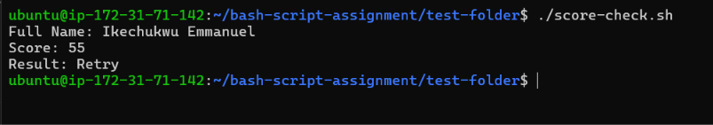

---

### Notes

Answer the following in your own words:

**1. What is the purpose of if-else in Bash?**

The if-else statement allows a Bash script to make decisions based on whether a condition is true or false. In this script, it checks the score and displays either Result: Pass or Result: Retry.

---

**2. What does `-ge` mean?**

-ge means “greater than or equal to” when comparing numbers in Bash. In this script, "$score" -ge 70 means the score must be 70 or higher for the result to be Pass.

---

**3. Why should conditions be tested with different values?**

Conditions should be tested with different values to make sure the script behaves correctly in different situations. In this task, testing 85 and 55 confirmed that the script correctly produces Pass for a score above the threshold and Retry for a score below it.

---

**4. How can conditionals help in automation scripts?**

Conditionals allow automation scripts to make decisions automatically based on different situations. For example, a script can check whether a service is running, whether a file exists, or whether a condition has been met, and then perform the appropriate action.

---

# Task 8 — Functions: Final Bash Automation Script

## Goal

Create a final Bash script using functions to organize reusable code.

### Evidence

#### Screenshot 1 — Content of `final-automation.sh`

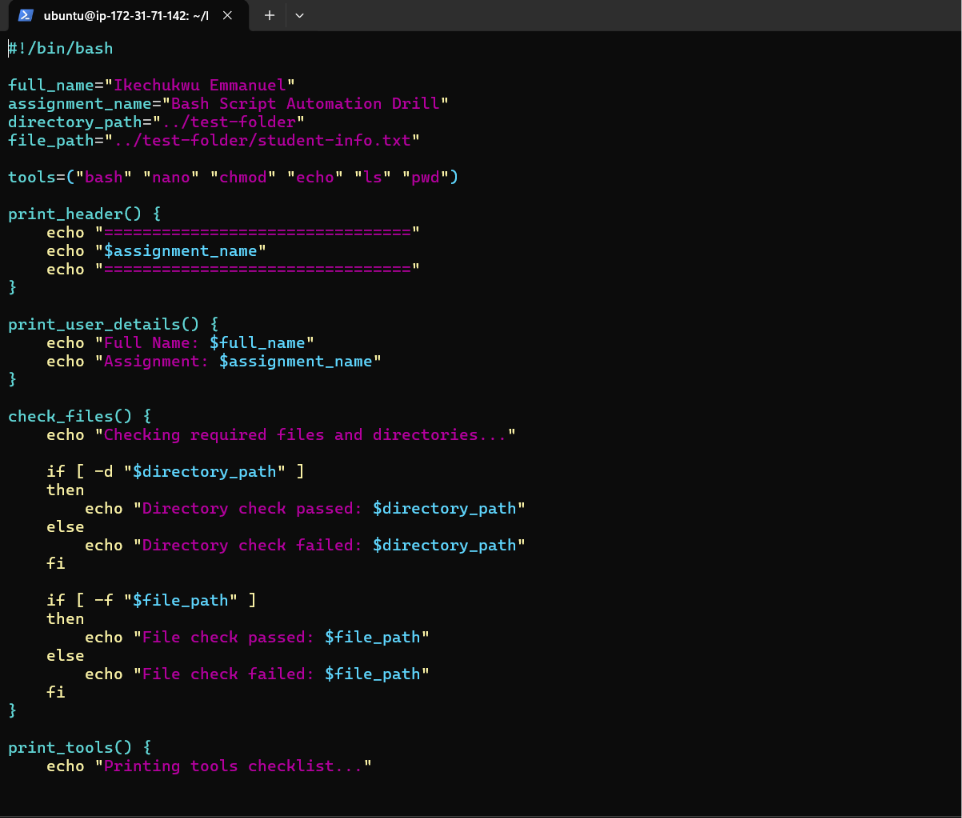

---

#### Screenshot 2 — Output of `./final-automation.sh`

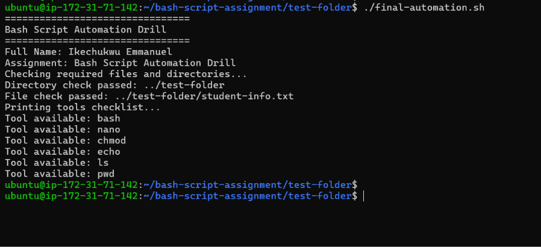

---

#### Screenshot 3 — Output of `ls -lah` showing all created scripts

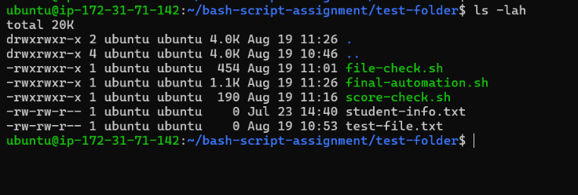

---

### Notes

Answer the following in your own words:

**1. What is a function in Bash?**

A function in Bash is a named block of commands that performs a specific task. Instead of writing the same commands repeatedly, we place them inside a function and call the function whenever we need it.
For example, in my script, check_files() contains the commands used to check whether the required directory and file exist.

---

**2. Why are functions useful in scripts?**

Functions make scripts more organized, reusable, and easier to maintain. They divide a large script into smaller sections, with each function responsible for a particular task.
If I need to change how one task works, I can modify its function without having to rewrite the entire script.

---

**3. Which functions did you create in this script?**

I created four functions:
- print_header() — displays the assignment header.
- print_user_details() — displays my full name and assignment name.
- check_files() — checks whether the required directory and file exist.
- print_tools() — uses a loop to display the Bash tools in the tools array.

---

**4. How does this final script combine variables, arrays, loops, conditionals, files, and functions?**

The final script combines all the concepts learned in the assignment. Variables store information such as my name and file paths. An array stores the Bash tools. A loop goes through the array and prints each tool. Conditionals check whether the required directory and file exist. File checks use -d and -f to validate the directory and file. Finally, functions organize these different operations into reusable sections.

---

# LinkedIn Post (Required)

## Evidence

#### LinkedIn Post URL

Paste your LinkedIn post URL here:

`https://www.linkedin.com/posts/ikechukwu-emmanuel_devops-linux-bash-ugcPost-7495806041054576641-6auN/?utm_source=share&utm_medium=member_desktop&rcm=ACoAAGENBPUBsLYqmgeLRkF6HTid7rCysjW2i7w`

---

#### Screenshot — Published LinkedIn post

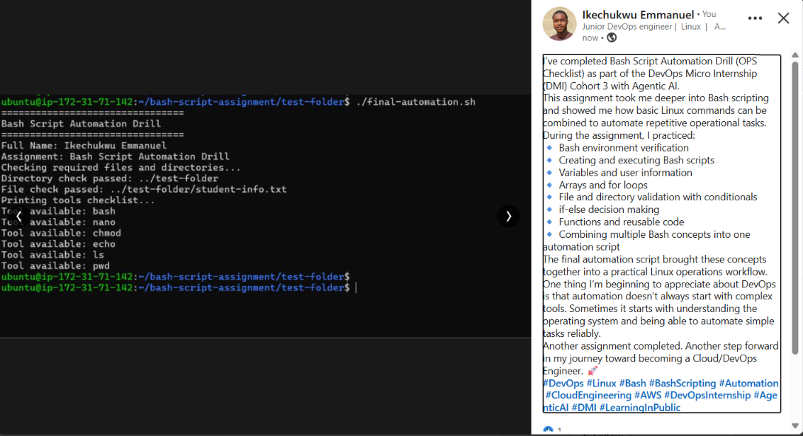

---

# Submission Instructions

- Add all required screenshots in your submission
- Full name must be visible in required screenshots
- All script files must be created and run successfully
- Required notes must be answered clearly for every task
- Do not expose sensitive information (keys, passwords, credentials)

---

# Completion Checklist

- [ ] Task 1: Environment setup verified, workspace created (Screenshots 1–2, Notes answered)
- [ ] Task 2: First script created, executed, permissions verified (Screenshots 1–3, Notes answered)
- [ ] Task 3: Variables script created and run (Screenshots 1–2, Notes answered)
- [ ] Task 4: Arrays and loops script created and run (Screenshots 1–2, Notes answered)
- [ ] Task 5: Counter loop script created and run (Screenshots 1–2, Notes answered)
- [ ] Task 6: File validation script created and run (Screenshots 1–3, Notes answered)
- [ ] Task 7: Pass/Retry conditional script tested with both values (Screenshots 1–4, Notes answered)
- [ ] Task 8: Final automation script created and run (Screenshots 1–3, Notes answered)
- [ ] All scripts run without errors
- [ ] Full Name visible in all required screenshots
- [ ] LinkedIn post published and URL submitted
- [ ] No sensitive data exposed

---

## 📌 About DMI & CloudAdvisory

DevOps Micro Internship (DMI) is a project-based DevOps program run by Pravin Mishra (The CloudAdvisory) focused on real-world execution, systems thinking, and career readiness.

It helps learners build strong DevOps foundations with hands-on experience.

---

## 📌 Resources

- 🌐 DMI Official Website: https://dmi.pravinmishra.com?utm_source=github&utm_medium=readme  
- 🎓 University: https://university.pravinmishra.com?utm_source=github&utm_medium=readme  
- 💬 Discord Community: https://discord.pravinmishra.com?utm_source=github&utm_medium=readme  
- 📝 Blog: https://dmi.pravinmishra.com/blog?utm_source=github&utm_medium=readme  
- ▶️ YouTube Playlist: https://www.youtube.com/playlist?list=PLFeSNDtI4Cho  
- 🔗 Pravin Mishra (LinkedIn): https://www.linkedin.com/in/pravin-mishra-aws-trainer/  
- 🏢 CloudAdvisory (LinkedIn): https://www.linkedin.com/company/thecloudadvisory/

---

*This submission is part of DevOps Micro Internship (DMI) Cohort 3 — Agentic AI Track.*