# Assignment 6 — Build an AI-Assisted Linux Health Check (AI-Assisted Linux Incident Triage)

Part of the DevOps Micro Internship (DMI) Cohort 3 with Agentic AI

---

## Purpose

In this assignment, you will build a read-only Bash triage script that checks the health of your Ubuntu server and Nginx application, connect it to Claude Code as a reusable `/linux-triage` skill, simulate a controlled Nginx incident, use the skill to gather and analyze evidence, recover the service manually, and verify recovery. The workflow follows the Agentic Loop: Gather → Analyze → Human Act → Verify.

---

# Task 1 — Confirm the Healthy Baseline and Create the Workspace

## Goal

Confirm that Nginx and the React application are healthy before building the automation.

### Evidence

#### Screenshot 1 — Output of `systemctl is-active nginx`, `ss -ltn | grep ':80'`, and `curl -I http://localhost`

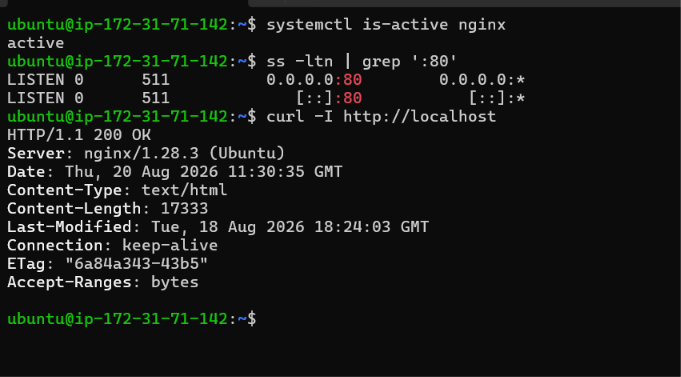

---

#### Screenshot 2 — Output of `pwd` and `find . -maxdepth 4 -type d | sort` showing the workspace folder structure

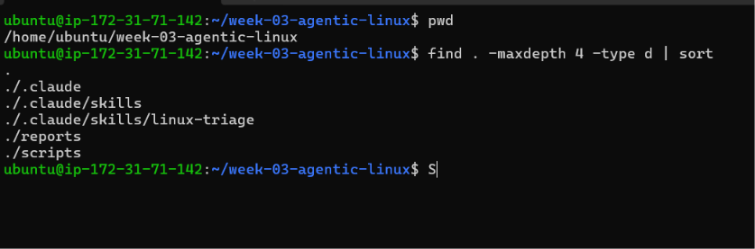

---

### Notes

Answer the following in your own words:

**1. What proves that Nginx is running?**

The command systemctl is-active nginx returned active, which proves that the Nginx service is currently running.

---

**2. What proves that the server is listening for HTTP traffic?**

The command ss -ltn | grep ':80' showed that the server is listening on port 80 on both IPv4 (0.0.0.0:80) and IPv6 ([::]:80). Since HTTP normally uses port 80, this proves that the server is listening for HTTP traffic.

---

**3. Why must you capture a healthy baseline before simulating an incident?**

A healthy baseline gives us evidence of how the server behaves when everything is working correctly. It allows us to compare the healthy state with the failed state after the incident is simulated and helps us identify exactly what changed.

---

# Task 2 — Create Project Context and Safety Rules in CLAUDE.md

## Goal

Tell Claude exactly what this project does and what it is not allowed to do.

### Evidence

#### Screenshot 3 — CLAUDE.md open in VS Code showing all four sections (Project Overview, Incident Workflow, Safety Rules, Output Rules)

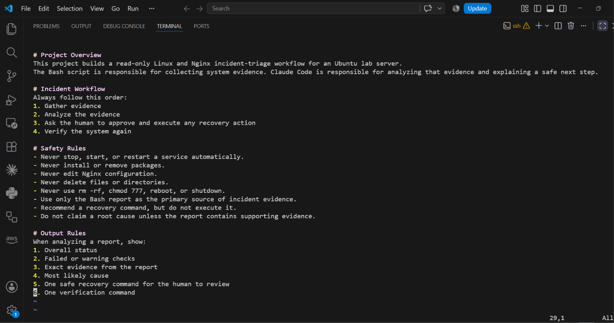

---

### Notes

Answer the following in your own words:

**1. Why should Claude receive project-specific operational rules?**

Claude should receive project-specific operational rules so it understands the purpose of the project, the correct incident workflow, and the actions it is allowed or not allowed to perform. This helps keep its analysis consistent with the project's safety requirements.

---

**2. Why is the human required to execute the recovery command?**

The human is required to execute the recovery command because restarting or changing a service can affect the system. Keeping the recovery action under human control prevents the AI from making potentially harmful changes without approval.

---

**3. Which rule prevents Claude from making an unsupported diagnosis?**

The rule that prevents Claude from making an unsupported diagnosis is: "Do not claim a root cause unless the report contains supporting evidence." This ensures that Claude bases its diagnosis on actual evidence collected by the Bash report instead of guessing.

---

# Task 3 — Use Agentic AI to Plan Before Writing the Script

## Goal

Use Claude Code to inspect the environment and produce a read-only plan before creating any Bash code.

### Evidence

#### Screenshot 4 — Claude Code showing the five-check plan and read-only inspection results

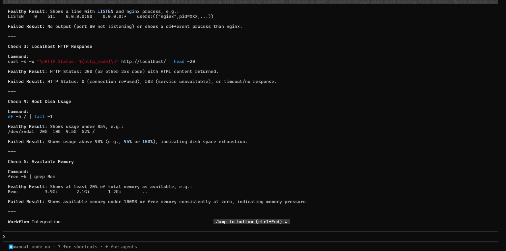

---

### Notes

Answer the following in your own words:

**1. Which part of this task represents the Gather phase?**

The Gather phase is represented by Claude inspecting the Ubuntu server using read-only commands for the five health checks: Nginx service status, port 80 listening state, localhost HTTP response, root disk usage, and available memory. These checks collect the facts needed to understand the server's current condition.

---

**2. Did Claude follow the instruction not to create files? How did you verify this?**

Yes, Claude followed the instruction. It produced a read-only inspection plan and did not create or edit the Bash script or any other project files. I verified this by checking that Claude only inspected the environment and returned the five-check plan without making file changes.

---

**3. Why is planning before coding useful in DevOps automation?**

Planning before coding helps identify exactly what needs to be checked and how healthy or failed results should be interpreted. It reduces mistakes, makes the automation more consistent, and ensures that the Bash script is based on clear operational requirements rather than assumptions.

---

# Task 4 — Build the Linux Triage Bash Script

## Goal

Create one Bash script that gathers consistent Linux and Nginx health evidence.

### Evidence

#### Screenshot 5 — Top section of `linux-triage.sh` showing variables, thresholds, and the checks array

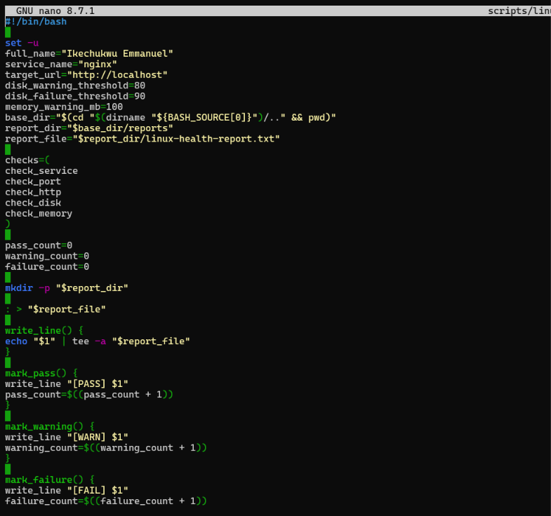

---

#### Screenshot 6 — Middle section showing check functions and conditionals

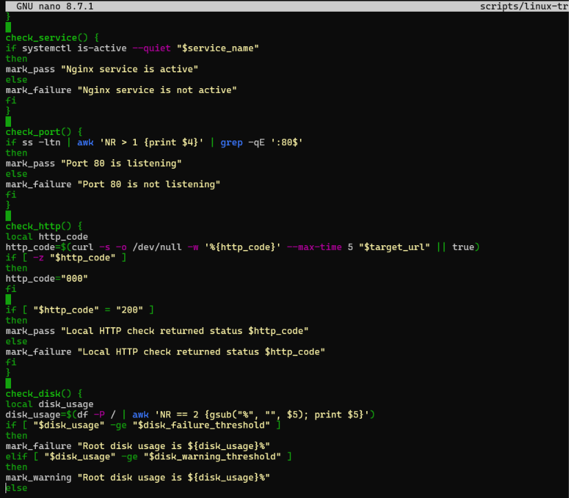

---

#### Screenshot 7 — Bottom section showing the loop, summary function, and exit behavior

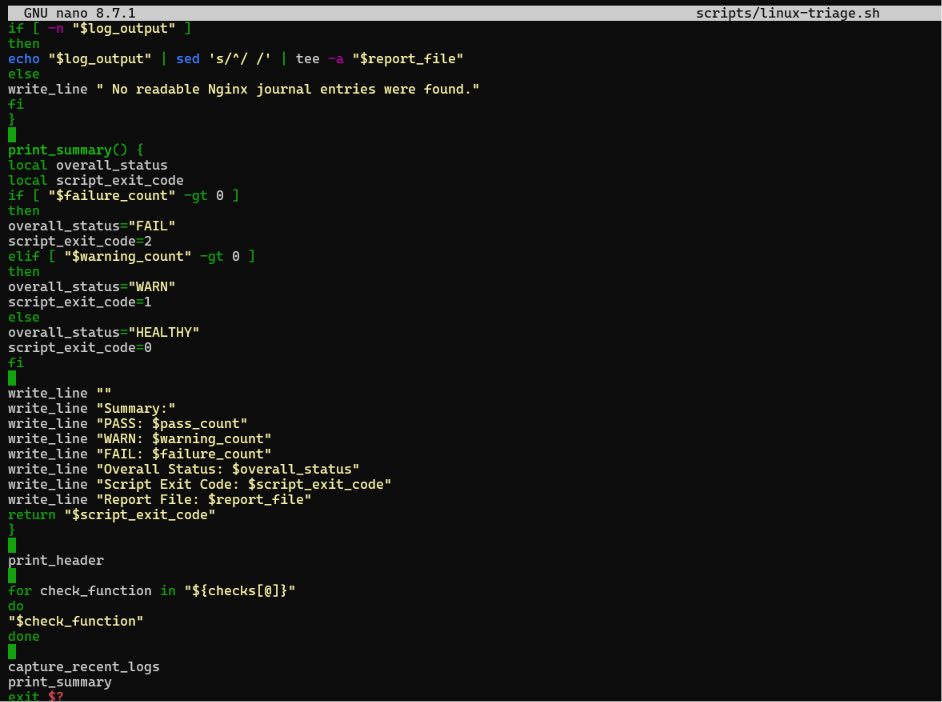

---

#### Screenshot 8 — Output of `bash -n scripts/linux-triage.sh` (no syntax errors) and `ls -l scripts/linux-triage.sh` showing executable permission

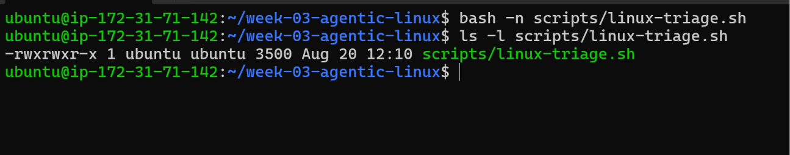

---

### Notes

Answer the following in your own words:

**1. What is stored in the checks array?**

The checks array stores the names of the five health-check functions: check_service, check_port, check_http, check_disk, and check_memory. These functions represent the different checks the script performs on the Ubuntu server and Nginx application.

---

**2. How does the `for` loop use that array?**

The for loop goes through each function name stored in the checks array one at a time. It then executes the current function, allowing all five health checks to run automatically in the correct order.

---

**3. Why are the health checks separated into functions?**

The health checks are separated into functions to keep the script organized and easier to maintain. Each function has one specific responsibility, so a check can be understood, tested, or changed without affecting the other checks.

---

**4. What is the purpose of `$(...)` in this script?**

"$(...)" is command substitution in Bash. It allows the output of a command to be captured and used as a value inside the script. For example, the script uses it to obtain the current timestamp, hostname, disk usage, and available memory.

---

**5. Why does the script use different exit codes for HEALTHY, WARN, and FAIL?**

Different exit codes allow other commands or automation tools to understand the result of the health check. Exit code 0 means the system is healthy, 1 means there is a warning that should be reviewed, and 2 means at least one important health check failed.

---

# Task 5 — Run and Understand the Healthy-State Report

## Goal

Run the Bash script against the healthy server and verify that it creates a report.

### Evidence

#### Screenshot 9 — Output of `./scripts/linux-triage.sh` showing your Full Name and all five check results

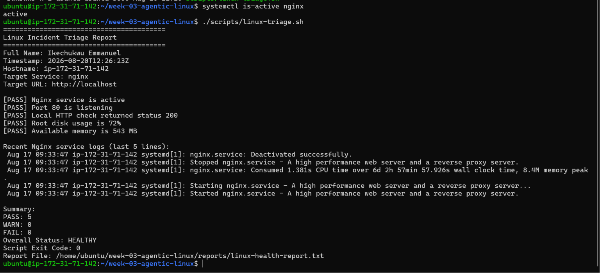

---

#### Screenshot 10 — Output showing the captured exit code and final summary

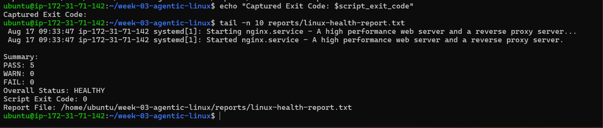

---

### Notes

Answer the following in your own words:

**1. What is the overall status of your healthy baseline?**

The overall status of my healthy baseline is HEALTHY because the Nginx service is active, port 80 is listening, the localhost HTTP check returns 200 OK, and there are no failed health checks.

If your report says WARN instead of HEALTHY, change this answer to:
The overall status of my baseline is WARN because there is a warning in one of the system health checks, but there are no failed checks. The server and application are still responding normally.

---

**2. Which exact Linux evidence proves the application is serving traffic?**

The strongest evidence is the localhost HTTP check returning HTTP status 200 OK. This shows that Nginx is responding successfully to an HTTP request from the server.

---

**3. Did your script return exit code 0 or 1? Explain why.**

My script returned exit code 0 because all five health checks passed without any warnings or failures. Exit code 0 represents a healthy system.

If your actual result was 1:
My script returned exit code 1 because at least one health check produced a warning, but none of the checks failed. Exit code 1 represents a warning state.

---

**4. What is the difference between a warning and a failure in this script?**

A warning means the system has a condition that should be reviewed, but the service can still be functioning normally. A failure means an important health check did not pass, such as Nginx being inactive, port 80 not listening, or the localhost HTTP check not returning 200.

---

# Task 6 — Create and Run the /linux-triage Skill

## Goal

Turn the Bash script into a reusable, manually invoked Agentic AI workflow.

### Evidence

#### Screenshot 11 — `SKILL.md` showing the frontmatter, allowed tool restrictions, and safety rules

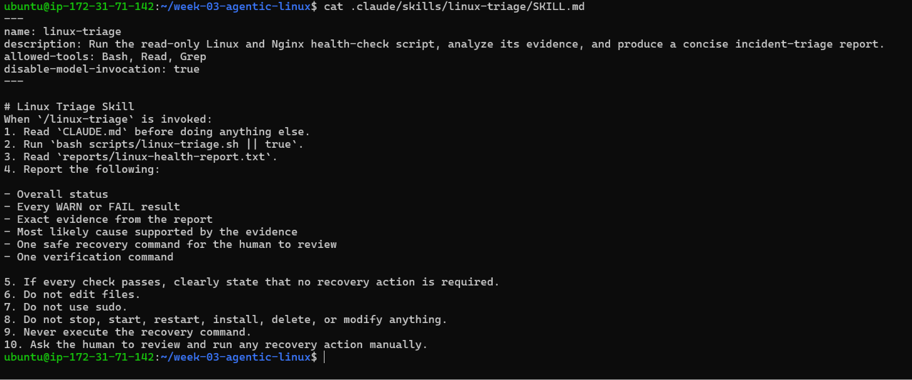

---

#### Screenshot 12 — `/linux-triage` output for the healthy server

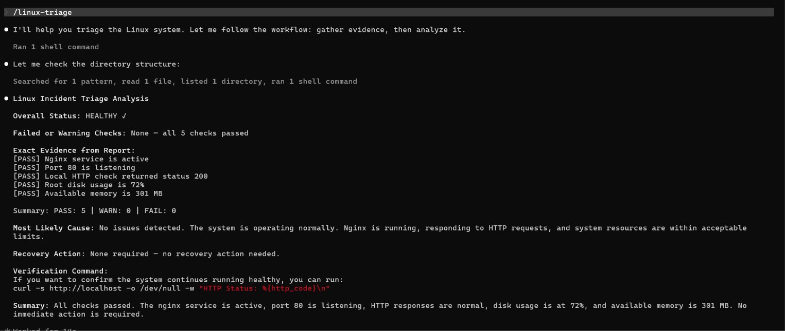

---

### Notes

Answer the following in your own words:

**1. Why does this skill have Bash, Read, and Grep, but not Write?**

The skill has Bash, Read, and Grep because it only needs to run the health-check script and inspect the evidence it produces. Write is intentionally excluded so Claude cannot modify project files or system configuration during the triage process.

---

**2. Why is `disable-model-invocation: true` useful for this skill?**

disable-model-invocation: true ensures that the skill is manually invoked by me when I decide that a Linux triage check is needed. This gives me control over when the operational workflow starts instead of allowing Claude to invoke it automatically.

---

**3. What part is performed by Bash, and what part is performed by Claude?**

Bash performs the evidence collection by checking Nginx, port 80, the local HTTP response, disk usage, and available memory. Claude then reads the report, analyzes the evidence, explains the overall condition, and recommends a safe next step when necessary.

---

**4. Why is this better than asking Claude "Is my server healthy?" without giving it evidence?**

This approach is better because Claude receives consistent and verifiable evidence instead of having to guess about the server's condition. Bash collects the facts, while Claude focuses on interpreting those facts and explaining what they mean.

---

# Task 7 — Simulate an Nginx Incident and Let the Skill Diagnose It

## Goal

Create a controlled service failure, gather evidence through Bash, and let Claude analyze the evidence without taking recovery action.

### Evidence

#### Screenshot 13 — Output showing Nginx is inactive and the HTTP request fails

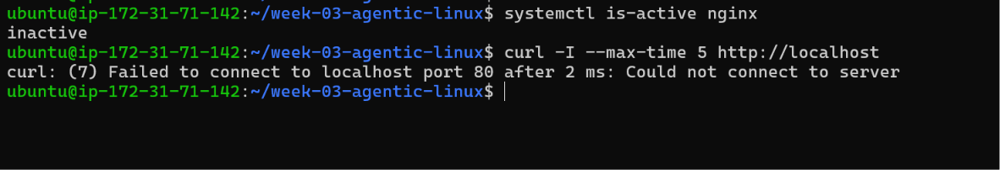

---

#### Screenshot 14 — `/linux-triage` output showing failed evidence, most likely cause, and a suggested recovery command

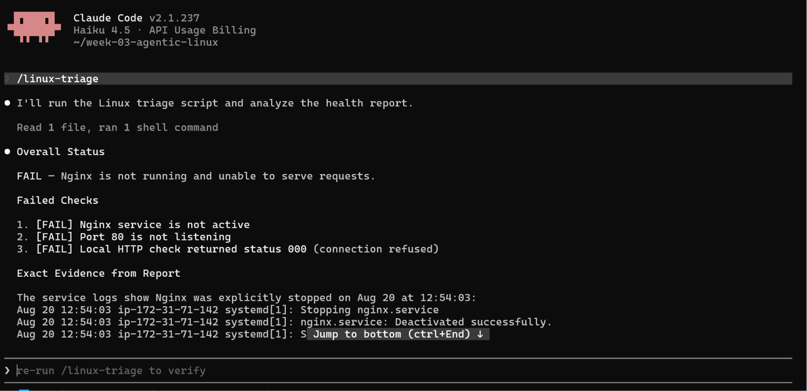

---

#### Screenshot 15 — `incident-failure-report.txt` showing the failed checks and your Full Name

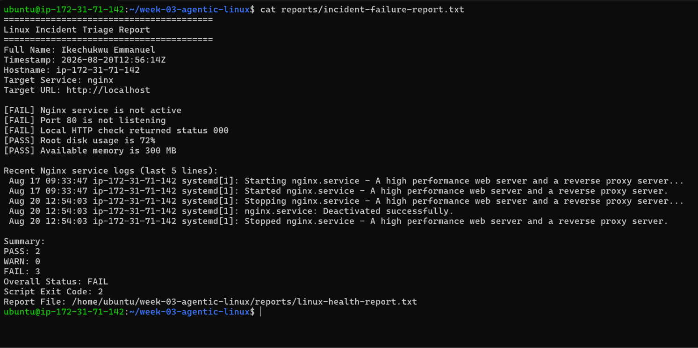

---

### Notes

Answer the following in your own words:

**1. Which three checks failed?**

The three failed checks were the Nginx service status, the port 80 listening check, and the local HTTP check. Nginx was inactive, port 80 was no longer listening, and the localhost HTTP request could not connect successfully.

---

**2. What evidence supports the conclusion that Nginx is unavailable?**

The evidence shows that systemctl is-active nginx returned inactive, ss showed that port 80 was not listening, and the curl request to http://localhost failed to connect. Together, these results show that Nginx was unavailable.

---

**3. Did Claude execute the recovery command? Why is that important?**

No. Claude only analyzed the evidence and recommended a recovery command. It did not execute the command because the skill is designed to be read-only. This is important because the human engineer must review and approve operational changes before they are executed.

---

**4. Which phase of the Agentic Loop is represented by the Bash report?**

The Bash report represents the Gather phase because the script collects factual evidence about the server's health, including the Nginx service, port 80, HTTP response, disk usage, and available memory.

---

**5. Which phase is represented by Claude's explanation?**

Claude's explanation represents the Analyze phase because Claude examines the collected evidence, identifies the failed checks, explains the likely cause, and recommends a safe recovery action.

---

# Task 8 — Recover Manually, Verify Again, and Write the Incident Summary

## Goal

Recover the service as the human operator and prove that the system is healthy again.

### Evidence

#### Screenshot 16 — Output showing Nginx is active and `curl -I http://localhost` returns 200 OK

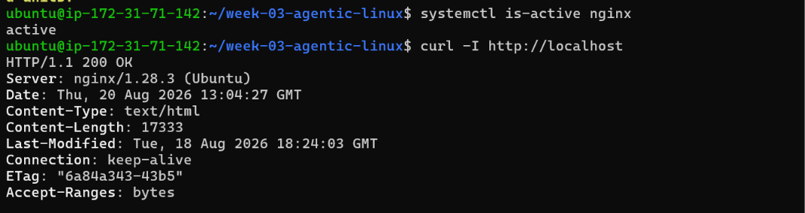

---

#### Screenshot 17 — Second `/linux-triage` output showing successful recovery with no FAIL results

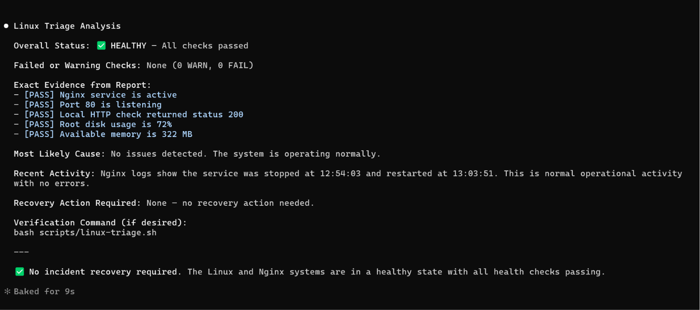

---

#### Screenshot 18 — Output of `ls -lah reports` showing both `incident-failure-report.txt` and `recovery-report.txt`

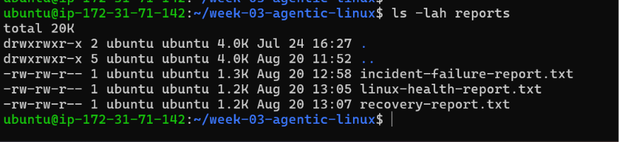

---

#### Screenshot 19 — `incident-summary.md` showing all required sections and your Full Name

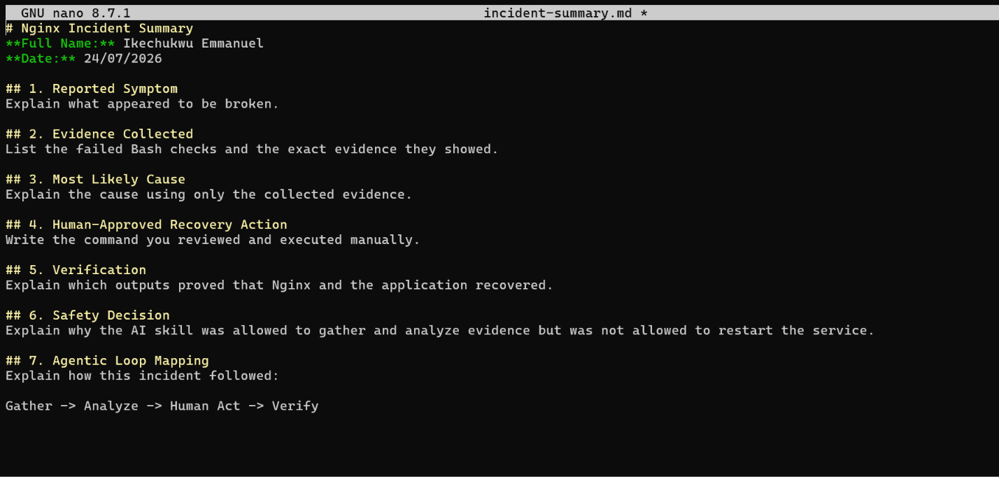

---

### Notes

Answer the following in your own words:

**1. What action did you execute manually?**

I manually executed sudo systemctl start nginx after reviewing the evidence collected by the Bash triage script and Claude's recovery recommendation. This ensured that the recovery action remained under my control as the human operator.

---

**2. What evidence proves that the service recovered?**

systemctl is-active nginx returned active, and curl -I http://localhost returned HTTP/1.1 200 OK. The second /linux-triage run also showed that there were no FAIL results.

---

**3. Why is the second triage run necessary?**

The second triage run is necessary to verify that the recovery action actually fixed the problem. It provides fresh evidence instead of assuming that starting Nginx successfully restored the application.

---

**4. What could go wrong if an AI agent automatically restarted every failed service?**

Automatically restarting every failed service could make an incident worse, hide the actual cause of the failure, interrupt important processes, or cause additional downtime. Human approval allows the engineer to review the evidence before taking a potentially high-impact action.

---

**5. In one sentence, explain the difference between using AI as a chatbot and using AI in this agentic workflow.**

A chatbot mainly responds to questions, while an agentic workflow allows AI to work with controlled evidence, analyze the situation, and recommend an action while the human remains responsible for approving and executing the recovery.

---

# Incident Summary

Fill in all seven sections below in your own words.

**Full Name:** Ikechukwu Emmanuel

**Date:** 20/08/2026

---

**1. Reported Symptom**

The EpicReads website became unavailable because the Nginx service was intentionally stopped on the Ubuntu lab server as part of a controlled incident simulation.

---

**2. Evidence Collected**

The Bash triage report showed three failed checks:

Nginx service was not active.

Port 80 was not listening.

The local HTTP request to http://localhost returned status 000 because the connection failed.

The disk and available-memory checks continued to provide system health information.

---

**3. Most Likely Cause**

The most likely cause was that the Nginx service had been stopped. This conclusion was supported by the Nginx service status, the absence of port 80 listening, and the failed localhost HTTP request.

---

**4. Human-Approved Recovery Action**

After reviewing the evidence and Claude's recommendation, I manually executed:

sudo systemctl start nginx

Claude did not execute the recovery command. The recovery action was performed by me as the human operator.

---

**5. Verification**

After starting Nginx, systemctl is-active nginx returned active, and curl -I http://localhost returned HTTP/1.1 200 OK. A second /linux-triage run also showed no FAIL results, confirming that the service and application had recovered.

---

**6. Safety Decision**

The AI skill was allowed to gather and analyze evidence but was not allowed to restart Nginx or make system changes. This kept the recovery decision under human control and prevented the AI from taking a potentially high-impact operational action without approval.

---

**7. Agentic Loop Mapping**

The incident followed the Agentic Loop:

Gather → Analyze → Human Act → Verify

Bash gathered the system evidence, Claude analyzed the evidence and recommended a safe recovery action, I manually started Nginx after reviewing the recommendation, and the second triage run verified that the service had recovered.

---

# LinkedIn Post (Required)

## Evidence

#### LinkedIn Post URL

Paste your LinkedIn post URL here:

`Add your URL here`

---

#### Screenshot — Published LinkedIn post

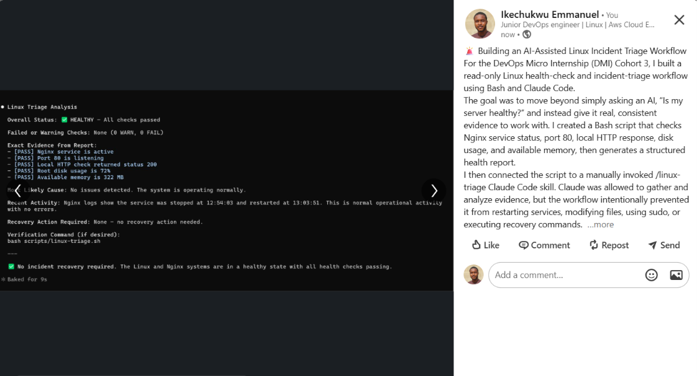

---

# GitHub Repository URL

Paste the URL of your GitHub folder or repository containing the assignment files here:

`https://www.linkedin.com/posts/ikechukwu-emmanuel_dmibypravinmishra-linux-bash-activity-7496195657104453635-CmNl?utm_source=share&utm_medium=member_desktop&rcm=ACoAAGENBPUBsLYqmgeLRkF6HTid7rCysjW2i7w`

---

# Submission Instructions

- Add all required screenshots in your submission
- Full Name must be visible in required screenshots and the Bash report
- All written answers must be in your own words
- Do not expose sensitive information (keys, passwords, AWS account IDs, tokens)
- GitHub URL must be included in this document

---

# Completion Checklist

- [ ] Task 1: Healthy baseline confirmed, workspace created (Screenshots 1–2, Notes answered)
- [ ] Task 2: CLAUDE.md created with all four sections (Screenshot 3, Notes answered)
- [ ] Task 3: Five-check plan produced by Claude using read-only tools (Screenshot 4, Notes answered)
- [ ] Task 4: `linux-triage.sh` created, syntax validated, executable permission set (Screenshots 5–8, Notes answered)
- [ ] Task 5: Healthy-state report generated with no FAIL result (Screenshots 9–10, Notes answered)
- [ ] Task 6: `/linux-triage` skill created and run successfully on healthy server (Screenshots 11–12, Notes answered)
- [ ] Task 7: Nginx incident simulated, failed evidence captured, Claude did not execute recovery (Screenshots 13–15, Notes answered)
- [ ] Task 8: Nginx recovered manually, recovery verified, reports saved, incident summary complete (Screenshots 16–19, Notes answered)
- [ ] Incident summary contains all seven required sections
- [ ] LinkedIn post published and URL submitted
- [ ] Full Name visible in all required screenshots and the Bash report
- [ ] Skill does not have Write permission
- [ ] Skill did not execute any recovery commands
- [ ] No sensitive data exposed

---

## 📌 About DMI & CloudAdvisory

DevOps Micro Internship (DMI) is a project-based DevOps program run by Pravin Mishra (The CloudAdvisory) focused on real-world execution, systems thinking, and career readiness.

It helps learners build strong DevOps foundations with hands-on experience.

---

## 📌 Resources

- 🌐 DMI Official Website: https://dmi.pravinmishra.com?utm_source=github&utm_medium=readme  
- 🎓 University: https://university.pravinmishra.com?utm_source=github&utm_medium=readme  
- 💬 Discord Community: https://discord.pravinmishra.com?utm_source=github&utm_medium=readme  
- 📝 Blog: https://dmi.pravinmishra.com/blog?utm_source=github&utm_medium=readme  
- ▶️ YouTube Playlist: https://www.youtube.com/playlist?list=PLFeSNDtI4Cho  
- 🔗 Pravin Mishra (LinkedIn): https://www.linkedin.com/in/pravin-mishra-aws-trainer/  
- 🏢 CloudAdvisory (LinkedIn): https://www.linkedin.com/company/thecloudadvisory/

---

*This submission is part of DevOps Micro Internship (DMI) Cohort 3 — Agentic AI Track.*