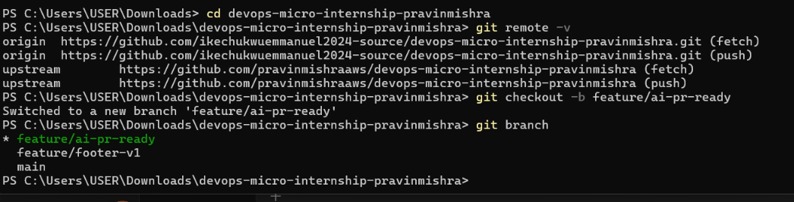
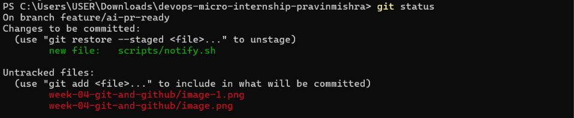
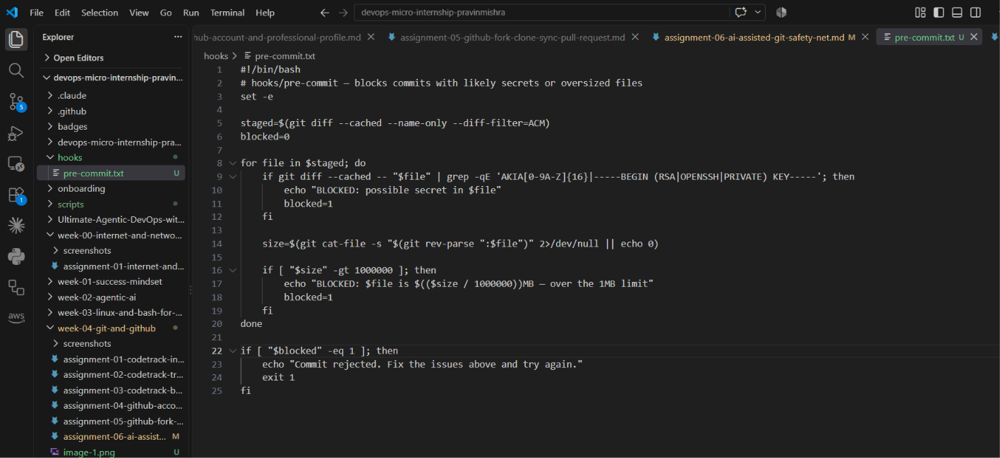
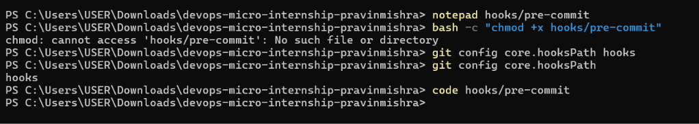
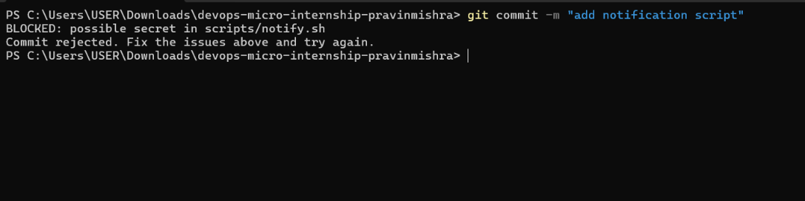
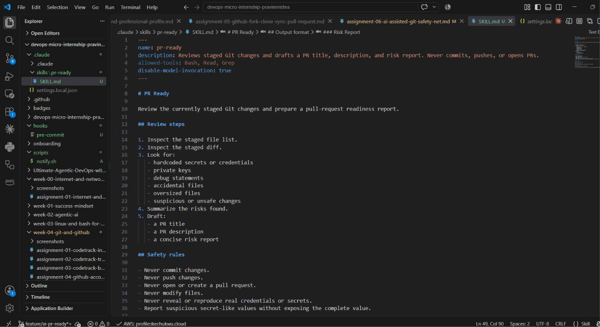
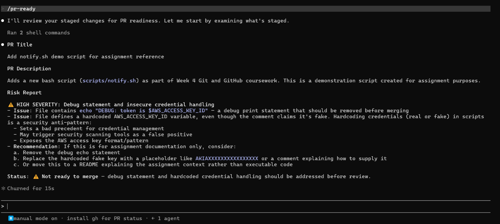
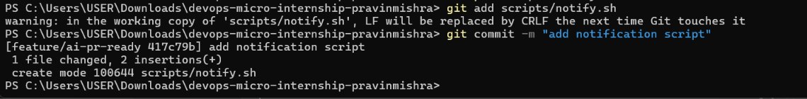
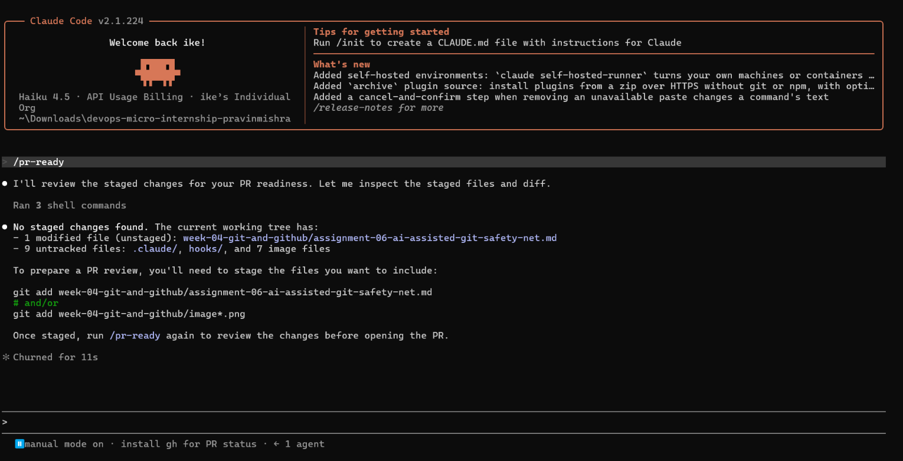
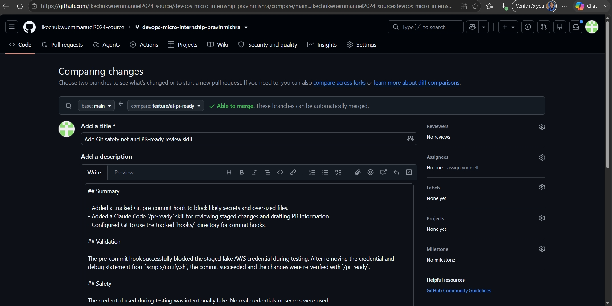

# Assignment 6 — Building an AI-Assisted Git Safety Net (PR Ready Check)

Part of the DevOps Micro Internship (DMI) Cohort 3 with Agentic AI

---

## Purpose

In Week 2 you built Claude Code hooks that block a dangerous action *before* it happens (`PreToolUse`), and a restricted skill that could look but not touch (`allowed-tools` without `Write`). In this assignment you will discover that Git has the exact same idea, decades older: a **pre-commit hook** that blocks a commit before it's created.

You will build both halves of a real "PR Ready" workflow:

1. A **Git hook that follows fixed rules** — scans staged changes for hardcoded secrets and oversized files and refuses the commit. No AI involved, no guessing, just a rule that gives the same answer every time.
2. A **restricted Claude Code skill** (`/pr-ready`) that reads your staged diff and drafts a Pull Request title, description, and a short list of things worth a second look — the kind of judgment a fixed rule can't make (mixed changes, missing context, unclear intent). The skill never commits, pushes, or opens the PR. You do that yourself, using its draft as a starting point.

This mirrors the Agentic Loop from Week 3's Linux triage assignment: **Gather → Analyze → Human Act → Verify**. The hook and the skill both gather and analyze; only you act.

---

# Task 0 — Confirm Your Fork and Create a Feature Branch

## Goal

Confirm you are working in your own fork, then create a dedicated branch for this assignment.

### Evidence

#### Screenshot 1 — Output of git remote -v and git branch showing the new branch

  

---

### Notes

**1. Why create a dedicated branch instead of doing this work on main?**

A dedicated feature branch keeps my changes separate from the stable main branch. It allows me to work, test, and review the assignment without accidentally affecting the main project. It also makes it easier to see exactly what belongs to this assignment and gives me a clean branch to use when creating the Pull Request.

---

# Task 1 — Stage a Change With Realistic Risk

## Goal

On your own fork of this repository (the one you've been submitting your DMI work in since onboarding), create a new branch and stage a change that a real reviewer should catch: a hardcoded-looking secret and a leftover debug statement.

### Evidence

#### Screenshot 1 — Output of  `git status` showing the staged file on feature/ai-pr-ready

---

### Notes

**1. Why does this assignment use an obviously fake key instead of a real one?**

The assignment uses an obviously fake key so we can safely test whether the pre-commit hook detects secret-like patterns without exposing a real AWS credential.
Using a real credential would be dangerous because it could give someone unauthorized access to an AWS account. The fake key lets us reproduce the risky situation in a controlled way while keeping the exercise safe.

---

# Task 2 — Write a Real Git Pre-Commit Hook

## Goal

Create a tracked, shareable pre-commit hook that blocks a commit containing secret-like patterns or files over 1MB.

### Evidence

#### Screenshot 2 — `hooks/pre-commit` open in VS Code showing the full script

---

#### Screenshot 3 — Output of `git config core.hooksPath` confirming it points to `hooks`

---

### Notes

**1. Why is `hooks/pre-commit` tracked in the repo instead of living only in `.git/hooks/`?**

Keeping the hook in hooks/pre-commit allows it to be tracked by Git and shared with other developers through the repository. The .git/hooks/ directory is local to each clone and its hooks are not normally version-controlled, so a tracked hook makes the safety rule easier to distribute and keep consistent across the team.

---

**2. Compare this to `PreToolUse` from Week 2 Assignment 6. What does each one intercept, and what do they have in common?**

PreToolUse intercepts an AI agent's tool call before the tool is executed, while a Git pre-commit hook intercepts a commit before Git creates it. Both are preventative safety mechanisms: they inspect an action before it happens and can stop the action when a defined rule is violated.

---

# Task 3 — Prove the Hook Blocks the Risky Commit

## Goal

Attempt to commit the staged file from Task 1 and show the hook rejecting it.

### Evidence

#### Screenshot 4 — Terminal showing `git commit` rejected with the hook's "BLOCKED" message naming the exact file

---

### Notes

**1. Which line in `hooks/pre-commit` matched your fake key, and why did it match?**

The hook matched the AKIA[0-9A-Z]{16} pattern in the grep -qE check. My fake key starts with AKIA and is followed by 16 uppercase letters, so it matches the pattern even though it is not a real AWS credential.

---

**2. Could this hook have caught a poorly-named variable that stores a secret without the `AKIA` prefix? What does that tell you about the limits of a fixed rule like this?**

No. The hook only checks for specific patterns such as an AKIA-style AWS key or a private-key header. A secret stored in a differently named variable without one of those patterns could be missed. This shows the limitation of fixed rules: they are predictable and fast, but they can only detect what their rules were designed to recognize.

---

# Task 4 — Build the `/pr-ready` Skill

## Goal

Create a manually invoked Claude Code skill that reads your staged changes and produces a PR-readiness report and a draft PR description — without writing, committing, or pushing anything itself.

### Evidence

#### Screenshot 5 — `SKILL.md` frontmatter showing `allowed-tools: Bash, Read, Grep` (no `Write`) and `disable-model-invocation: true`

---

#### Screenshot 6 — `/pr-ready` output while the risky file is still staged, showing it flagged the secret and/or debug statement

---

### Notes

**1. Why does `/pr-ready` have `Bash` and `Read` but not `Write`?**

/pr-ready needs Bash and Read so it can inspect the staged Git files and diff and run read-only Git commands during the review. It does not have Write because it is designed only to review and report findings. Without Write, the AI cannot modify or overwrite files while performing the safety check.

---

**2. The pre-commit hook and `/pr-ready` both looked at the same staged diff. Did they flag the same things? What did one catch that the other didn't?**

They both detected the fake AWS credential in scripts/notify.sh, but they had different purposes. The pre-commit hook acted as a strict gate and blocked the commit when it detected the secret-like pattern. /pr-ready performed a broader review and could identify additional risks such as the debug statement exposing the token and provide a risk report plus a drafted PR title and description.

---

# Task 5 — Fix the Issues and Re-Verify

## Goal

Remove the secret and debug statement, then prove both gates now pass clean.

### Evidence

#### Screenshot 7 — `git commit` succeeding after the fix (no BLOCKED message)

---

#### Screenshot 8 — Second `/pr-ready` run showing a clean risk report and a drafted PR title + description

---

### Notes

**1. What exactly did you change to satisfy the pre-commit hook?**

I removed the hardcoded fake AWS access key and the debug echo statement from scripts/notify.sh. This removed the secret-like pattern that the pre-commit hook detected and also removed the debug output that exposed the token. After staging the changes again, the commit passed the hook without a BLOCKED message.

---

# Task 6 — Push and Open a Pull Request Using the AI Draft

## Goal

Push your branch and open a real Pull Request, using `/pr-ready`'s drafted title and description as your starting point — read it critically and edit before you use it.

**Important:** Open this Pull Request with base repository set to **your own fork** — not the shared upstream `pravinmishraaws/devops-micro-internship-pravinmishra` repository. This assignment's hook and skill files are your own practice work, not a change meant for the shared class repo.

### Evidence

#### Screenshot 9 — Your Pull Request showing the base repository is your own fork, plus the title and description, with the `/pr-ready` draft visible for comparison (paste it in the PR conversation or your notes below)

---

#### PR Link

https://github.com/ikechukwuemmanuel2024-source/devops-micro-internship-pravinmishra/pull/1

---

### Notes

**1. What, if anything, did you edit in the AI's drafted PR description before using it? Why?**

I reviewed the AI-generated PR description and edited it where necessary to make sure it accurately described the changes I actually made. I wanted the final description to be clear and truthful rather than submitting the AI's draft without checking it.

---

**2. If you had blindly copy-pasted the AI's draft without reading it, what could go wrong?**

The AI could include information that is inaccurate, incomplete, or unrelated to the actual changes. I could end up submitting a misleading PR description or claiming that something was tested or implemented when it was not. This is why the human needs to review the AI's output before using it.

---

**3. Why does this PR need to target your own fork instead of the shared upstream repository?**

This assignment is practice work that belongs to my own fork. The pre-commit hook and /pr-ready skill are changes I created for this exercise, so they should not be submitted as changes to the shared upstream repository used by the class. Targeting my own fork keeps my practice work separate from the shared project.

---

# Task 7 — Map the Workflow to the Agentic Loop

## Goal

Explain this assignment's workflow using the same Gather → Analyze → Human Act → Verify structure from Week 3.

### Notes

**1. Which step(s) represent Gather?**

The Gather step is when the Git information is collected automatically, especially when Git identifies the staged files and staged diff. The /pr-ready skill then has the information it needs to review the actual changes.

---

**2. Which step(s) represent Analyze?**

The Analyze step is the /pr-ready review. It examines the staged changes, looks for risks such as secrets and debug statements, and uses that information to produce a risk report and draft the PR title and description.

---

**3. Which step is Human Act, and why must a human — not Claude — run `git commit`, `git push`, and open the PR?**

Human Act is the step where I make the final decision and perform the Git actions. A human must run git commit, git push, and open the PR because AI output is advice and can be wrong or incomplete. Keeping these actions under human control prevents the AI from making changes to the shared codebase without human approval.

---

**4. Which step is Verify?**

Verify is when the automated checks run again after the changes have been fixed. In this assignment, the pre-commit hook confirms that the risky file can now be committed, and /pr-ready is run again to confirm that the staged changes have a clean risk report.

---

**5. In one or two sentences: why do you need *both* the fixed-rule pre-commit hook and the AI skill? Isn't one enough?**

Both are needed because they do different jobs. The pre-commit hook provides a fixed rule that can automatically block known problems, while the AI skill provides broader judgment by reviewing the changes and identifying risks that a simple rule may not catch.

---

# Task 8 — LinkedIn Post

## Goal

Publish a LinkedIn post summarizing what you built and what you learned about combining fixed-rule safety checks with AI-assisted review.

### Evidence

#### LinkedIn Post URL

'https://lnkd.in/p/d6JEukum'

---

## Key Learnings

Add 3-5 bullet points on what you learned this week.

Key Learnings
- I learned how fixed Git rules can prevent risky changes before they become commits.
- I learned how AI assisted review can provide broader context and identify issues that simple rules may miss.
- I learned that AI should support decision making rather than blindly execute sensitive Git operations.
- I learned how to combine automated checks with human approval to create a safer DevOps workflow.
- I learned the importance of reviewing AI generated Pull Request information before using it.

---

# Submission Instructions

- Ensure `hooks/pre-commit` and `.claude/skills/pr-ready/SKILL.md` are committed to your GitHub repository
- Add all required screenshots to your submission
- All written answers must be in your own words
- Do not use a real secret or credential anywhere in your submission — the fake key in Task 1 is intentional and must stay clearly fake
- Open your Pull Request against your own fork, not the shared upstream repository
- Push your final changes to your forked repository
- Include your PR link and LinkedIn post URL

---

## GitHub Repository URL

Paste your forked repository URL here:

`https://github.com/ikechukwuemmanuel2024-source/devops-micro-internship-pravinmishra.git`

---

# Completion Checklist

- [ ] Branch `feature/ai-pr-ready` created with a staged file containing a fake secret and a debug statement
- [ ] `hooks/pre-commit` created and tracked in the repo (not only in `.git/hooks/`)
- [ ] `core.hooksPath` configured to point at `hooks/`
- [ ] Pre-commit hook shown blocking the risky commit
- [ ] `.claude/skills/pr-ready/SKILL.md` created with correct `allowed-tools` (no `Write`) and `disable-model-invocation: true`
- [ ] `/pr-ready` run against the risky diff and shown flagging issues
- [ ] Risky file fixed; `git commit` succeeds cleanly
- [ ] `/pr-ready` re-run showing a clean report and drafted PR title/description
- [ ] Pull Request opened using the AI draft as a starting point, with your own fork as the base repository (not upstream), PR link included
- [ ] Agentic Loop mapping (Task 7) completed in your own words
- [ ] LinkedIn post published and URL submitted
- [ ] All required screenshots added
- [ ] GitHub repository URL provided

---

## 📌 About DMI & CloudAdvisory

DevOps Micro Internship (DMI) is a project-based DevOps program run by Pravin Mishra (The CloudAdvisory) focused on real-world execution, systems thinking, and career readiness.

It helps learners build strong DevOps foundations with hands-on experience.

---

## 📌 Resources

- 🌐 DMI Official Website: https://dmi.pravinmishra.com?utm_source=github&utm_medium=readme  
- 🎓 University: https://university.pravinmishra.com?utm_source=github&utm_medium=readme  
- 💬 Discord Community: https://discord.pravinmishra.com?utm_source=github&utm_medium=readme  
- 📝 Blog: https://dmi.pravinmishra.com/blog?utm_source=github&utm_medium=readme  
- ▶️ YouTube Playlist: https://www.youtube.com/playlist?list=PLFeSNDtI4Cho  
- 🔗 Pravin Mishra (LinkedIn): https://www.linkedin.com/in/pravin-mishra-aws-trainer/  
- 🏢 CloudAdvisory (LinkedIn): https://www.linkedin.com/company/thecloudadvisory/

---

*This submission is part of DevOps Micro Internship (DMI) Cohort 3 — Agentic AI Track.*
