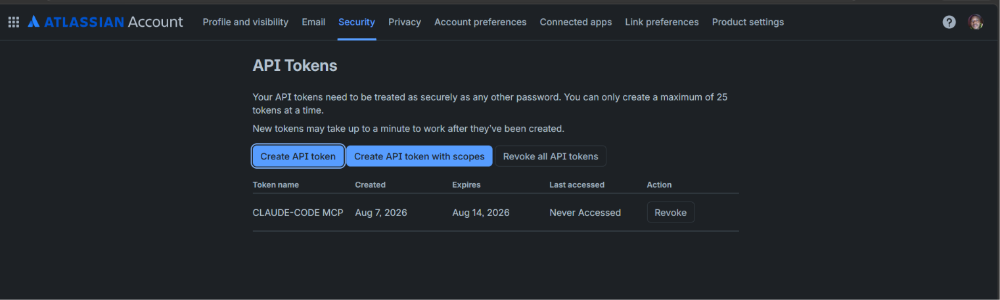
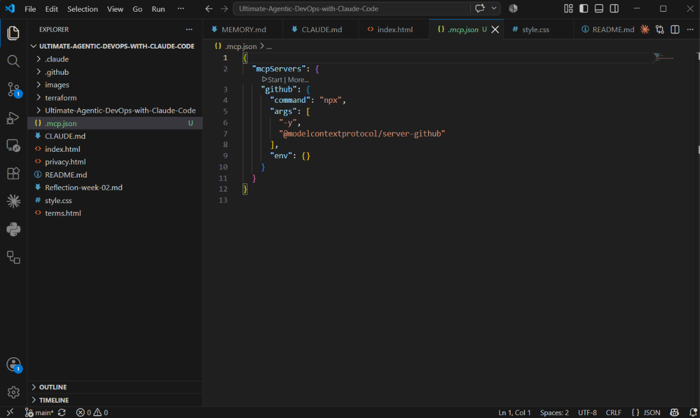
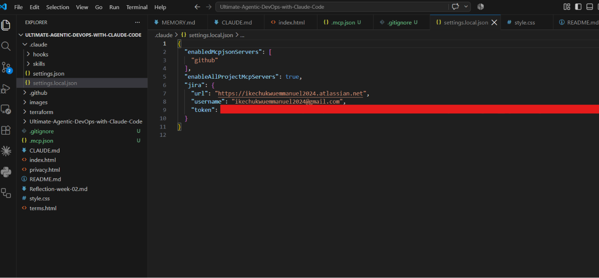
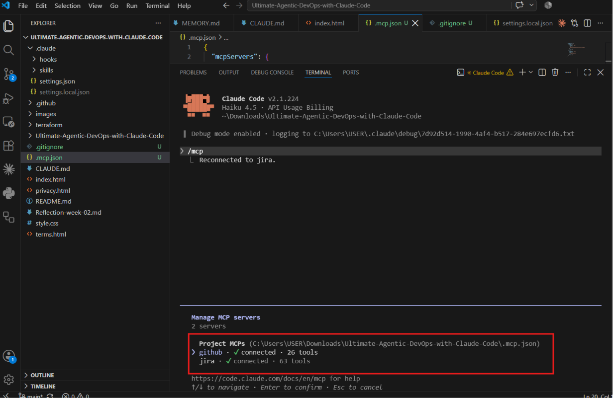
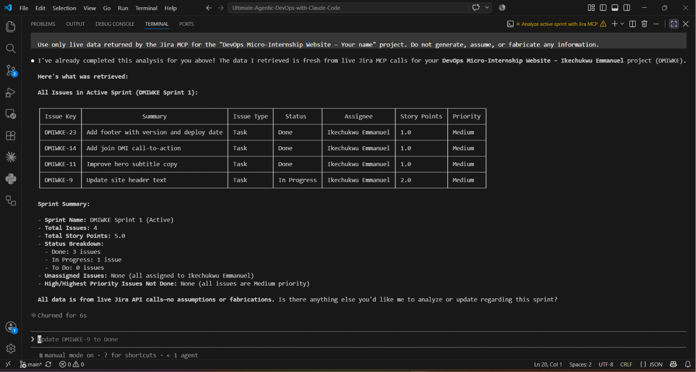
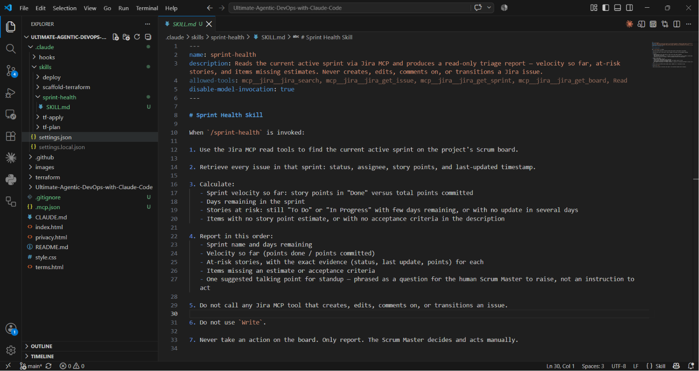
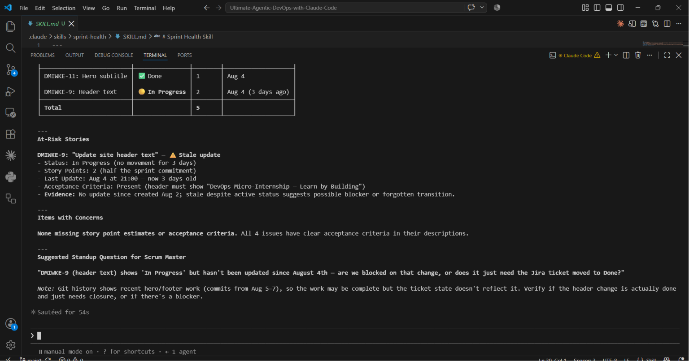
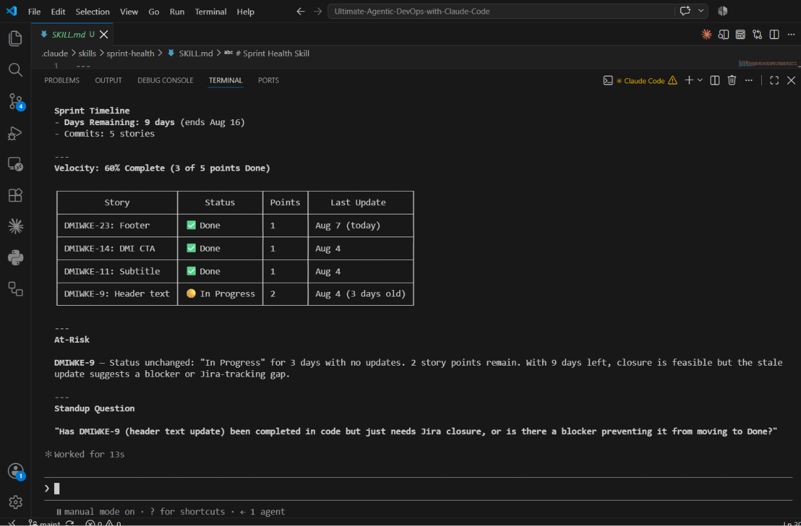

# Assignment 5 — AI-Assisted Sprint Health Report via Jira MCP

Part of the DevOps Micro Internship (DMI) Cohort 3 with Agentic AI

---

## Purpose

In this assignment, you will connect Claude Code to your Jira board through an MCP server, the same way you connected it to GitHub in Week 2, and build a read-only `/sprint-health` skill. The skill reads your current sprint through Jira's API and reports sprint velocity, stories at risk of missing the sprint, and items missing an estimate — but it must never create, edit, comment on, or transition a single ticket itself. You will prove that boundary holds by making a real change on the board yourself and confirming the skill only ever reports, never acts.

---

# Task 1 — Create a Jira API Token

## Goal

Generate an API token from your Atlassian account that the MCP server will use to authenticate with your Jira site. Do not screenshot the token value itself.

### Evidence

#### Screenshot 1 — Jira API token creation confirmation page showing the token name, with the token value not visible

### Notes You Must Write (Very Important):

Why does the MCP server need your site URL and account email in addition to the token?

The API token alone is not enough because it only acts as a password for authentication. The Jira site URL tells the MCP server which Atlassian workspace to connect to, while the account email identifies the user who owns the API token. Together, the site URL, account email, and API token allow the MCP server to authenticate securely and access the correct Jira instance.

---

# Task 2 — Create .mcp.json at the Project Root

## Goal

Create or update `.mcp.json` at your project root with a Jira MCP server block, following the same shape as the GitHub MCP server you configured in Week 2.

### Evidence

#### Screenshot 2 — `.mcp.json` open in VS Code showing the Jira server configuration

### Notes You Must Write (Very Important):

Compare this jira block to the github block from Week 2 Assignment 5. The GitHub server ran via npx (a Node.js package); this one runs via uvx (a Python package) — what stays exactly the same shape despite that difference, and why doesn't Claude Code care which language a given MCP server is written in?

Although the GitHub MCP server uses npx and the Jira MCP server uses uvx, the overall MCP configuration has the same structure. Both define a server name, the command used to start the server, and any required arguments or environment variables. Claude Code does not care whether the server is written in JavaScript, Python, or another language because it communicates with every MCP server through the same standardized MCP protocol. As long as the server follows the protocol, Claude Code can interact with it regardless of the implementation language.

---

# Task 3 — Add Your Credentials to settings.local.json

## Goal

Add your Jira site URL, account email, and API token to `.claude/settings.local.json`, and confirm that file is listed in `.gitignore` so it is never committed.

### Evidence

#### Screenshot 3 — `settings.local.json` open in VS Code showing the `env` section, with the actual token value blurred or covered

### Notes You Must Write (Very Important):

Why must JIRA_API_TOKEN live in settings.local.json and never in .mcp.json?

The JIRA_API_TOKEN must be stored in settings.local.json because it is a secret used to authenticate my Jira account. This file is local to my computer and is ignored by Git, so the token is not exposed if I push my project to GitHub. The .mcp.json file only defines how the MCP server should run and can be shared safely with others. Keeping the token out of .mcp.json helps protect sensitive credentials and follows security best practices.

---

# Task 4 — Verify the Connection with /mcp

## Goal

Restart Claude Code and confirm the Jira MCP server shows as connected.

### Evidence

#### Screenshot 4 — `/mcp` output showing `jira: connected`

---

# Task 5 — Run a Live Query to Prove Real Board Data

## Goal

Ask Claude to list the issues in your current active sprint through the Jira MCP connection, and confirm the result matches what you see on your live board in the browser.

### Evidence

#### Screenshot 5 — Claude's response showing the live sprint issue list retrieved via Jira MCP

### Notes You Must Write (Very Important):

How did you confirm this was real board data and not something Claude guessed?

I confirmed it was real board data by comparing Claude's Jira MCP output with my live Jira Scrum board in the browser. The issue keys, summaries, statuses, assignees, story points, priorities, sprint name, and totals matched exactly. To verify it further, I manually updated some information on my Jira board and ran the query again. The new report immediately reflected the changes I made, confirming that Claude was retrieving live data directly from Jira through the MCP connection rather than generating or guessing the information.

---

# Task 6 — Build the /sprint-health Skill

## Goal

Create a `/sprint-health` skill restricted to read-only Jira tools plus `Read`, with no issue-mutating tools and no `Write`. Run it and confirm it produces a report covering sprint velocity, at-risk stories, and items missing an estimate.

### Evidence

#### Screenshot 6 — `SKILL.md` frontmatter showing `allowed-tools` limited to read-only Jira tools plus `Read`, with `disable-model-invocation: true`

#### Screenshot 7 — `/sprint-health` output showing the full triage report against your real sprint

### Notes You Must Write (Very Important):

1. Which Jira MCP tools does this skill's allowed-tools list include, and which mutating tools (create issue, update issue, transition issue, add comment) does it deliberately exclude?

The skill's allowed-tools list includes mcp__jira__jira_search, mcp__jira__jira_get_issue, mcp__jira__jira_get_sprint, mcp__jira__jira_get_board, and the Read tool. These tools allow the skill to retrieve and analyze information from my Jira board without making any changes. It deliberately excludes all mutating tools such as creating issues, updating issues, transitioning issues, adding comments, and any Write permission. This ensures the skill remains completely read-only and only reports the current state of the sprint.

2. Why does a Scrum Master need this restriction more than almost any other role in this course?

A Scrum Master is responsible for monitoring the team's progress, facilitating Scrum events, and helping the team identify and remove blockers. Their role is to provide guidance and maintain transparency rather than make decisions for the team. By keeping the AI skill read-only, it can analyze sprint health and highlight potential risks without changing any Jira issues. This ensures that every update to the board is made intentionally by a human, preserving accountability, preventing accidental changes, and allowing the Scrum Master to make informed decisions based on accurate, real-time information.

---

# Task 7 — Prove the Skill Never Mutates the Board

## Goal

Manually update one ticket on your board in the browser (for example, move a story to "Done" or add a missing estimate), then run `/sprint-health` again and confirm the new report reflects your change — proving the skill only ever reads live state and never wrote to the board itself.

### Evidence

#### Screenshot 8 — Second `/sprint-health` run showing the report now reflects your manual board change

### Notes You Must Write (Very Important):

Map this assignment to Gather → Analyze → Human Act → Verify from Week 3 Assignment 6. Which step did you perform manually in the browser, and why must that step stay human?

This assignment follows the Gather → Analyze → Human Act → Verify workflow from Week 3 Assignment 6.
Gather: The /sprint-health skill gathered live sprint data from my Jira board using the read-only Jira MCP tools.
Analyze: The skill analyzed the sprint by calculating sprint velocity, identifying at-risk stories, and detecting items missing estimates or acceptance criteria.
Human Act: I manually updated a Jira issue in my browser by changing its status/estimate. This step had to remain human because modifying the sprint board is the Scrum Master's responsibility, and the AI was intentionally restricted to read-only access.
Verify: I ran /sprint-health again, and the updated report reflected the manual change I made. This confirmed that the skill only reads the current state of the board and never performs any actions on Jira itself.

---

# Submission Instructions

Complete all tasks in sequence.

Your submission must include:
- All 8 required screenshots
- All the required notes

---

# Completion Checklist

- [ ] Task 1: Jira API token created, value never screenshotted (Screenshot 1)
- [ ] Task 2: `.mcp.json` has the Jira server block (Screenshot 2)
- [ ] Task 3: Credentials stored in `settings.local.json`, token blurred, file gitignored (Screenshot 3)
- [ ] Task 4: `/mcp` shows the Jira server connected (Screenshot 4)
- [ ] Task 5: Live query returned real sprint data, verified against the browser (Screenshot 5)
- [ ] Task 6: `/sprint-health` skill created with correct read-only `allowed-tools`, and produced a full report (Screenshots 6–7)
- [ ] Task 7: A manual board change was reflected in a second `/sprint-health` run (Screenshot 8)
- [ ] Skill never created, edited, transitioned, or commented on any issue
- [ ] Reflection answered (Notes)
- [ ] No API token value exposed

---

## 📌 About DMI & CloudAdvisory

DevOps Micro Internship (DMI) is a project-based DevOps program run by Pravin Mishra (The CloudAdvisory) focused on real-world execution, systems thinking, and career readiness.

It helps learners build strong DevOps foundations with hands-on experience.

---

## 📌 Resources

- 🌐 DMI Official Website: https://dmi.pravinmishra.com?utm_source=github&utm_medium=readme  
- 🎓 University: https://university.pravinmishra.com?utm_source=github&utm_medium=readme  
- 💬 Discord Community: https://discord.pravinmishra.com?utm_source=github&utm_medium=readme  
- 📝 Blog: https://dmi.pravinmishra.com/blog?utm_source=github&utm_medium=readme  
- ▶️ YouTube Playlist: https://www.youtube.com/playlist?list=PLFeSNDtI4Cho  
- 🔗 Pravin Mishra (LinkedIn): https://www.linkedin.com/in/pravin-mishra-aws-trainer/  
- 🏢 CloudAdvisory (LinkedIn): https://www.linkedin.com/company/thecloudadvisory/

---

*This submission is part of DevOps Micro Internship (DMI) Cohort 3 — Agentic AI Track.*
