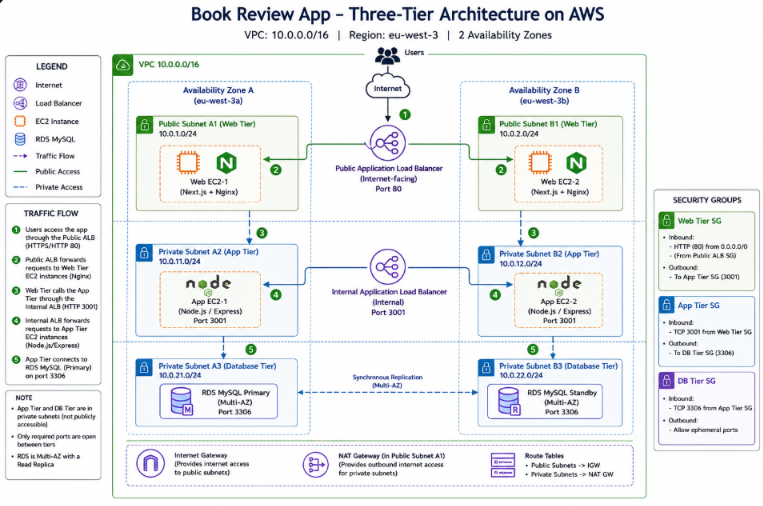
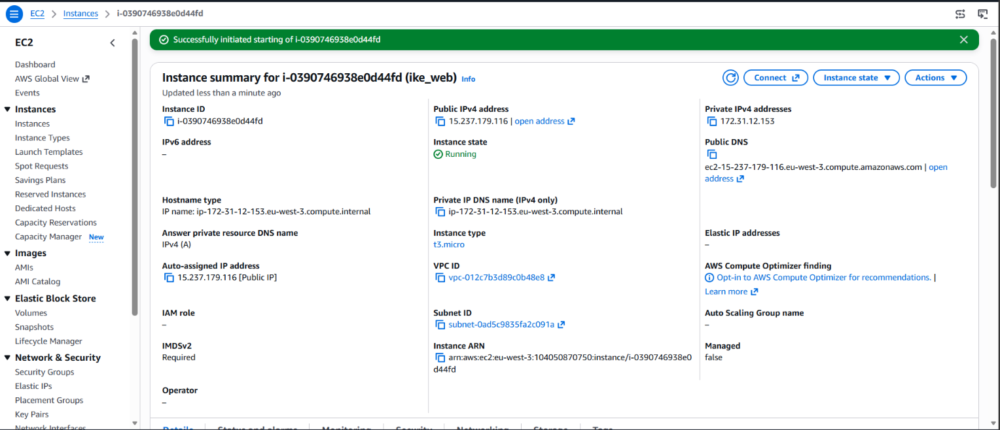
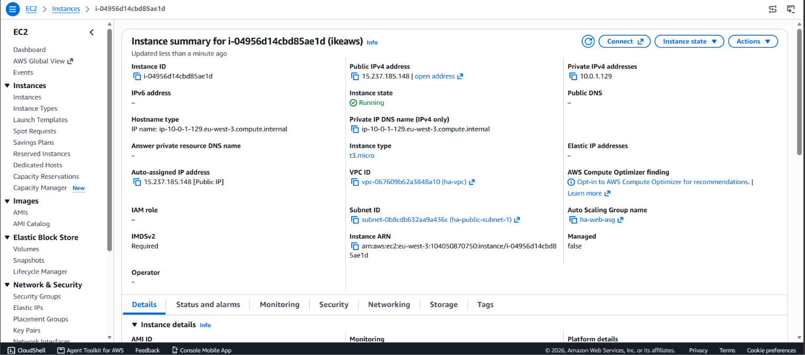
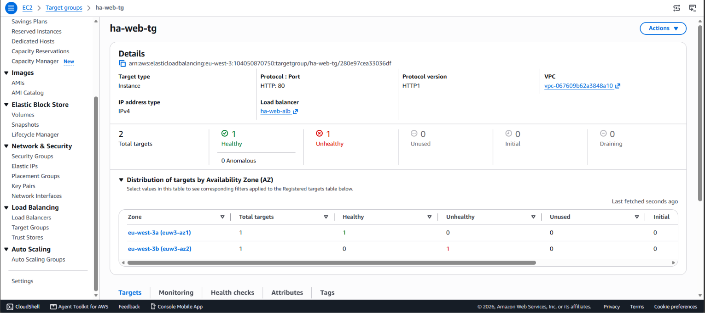
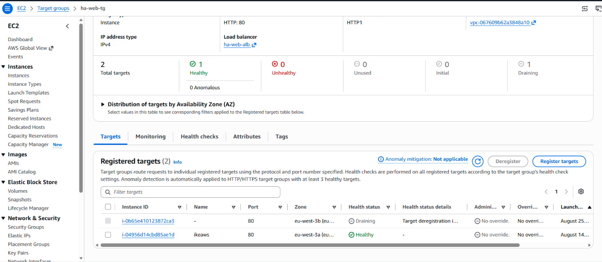
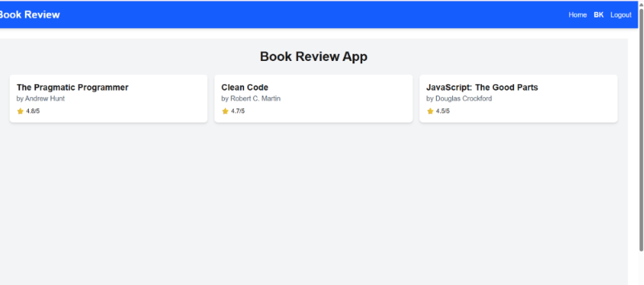
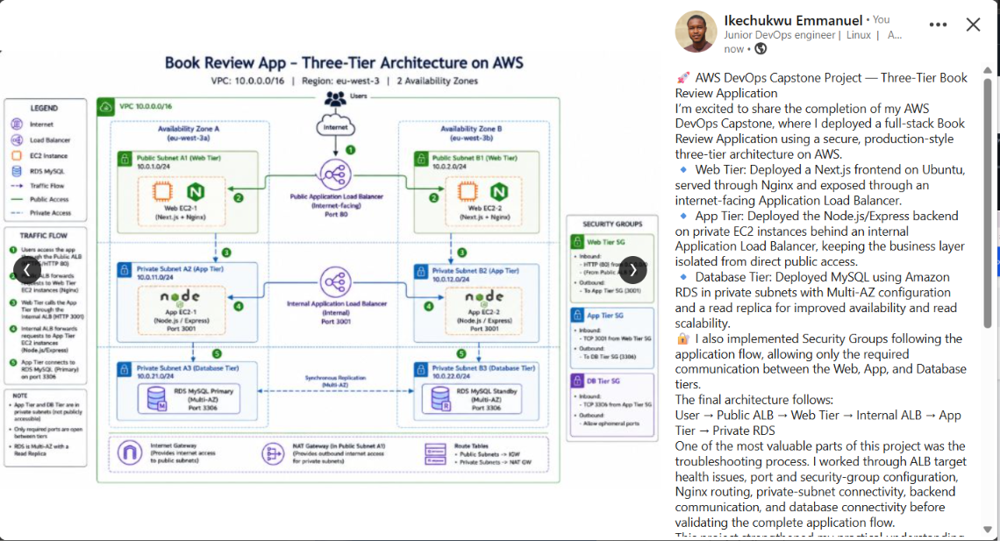

# Assignment 6 — Capstone Assignment — Deploy Book Review App (Three-Tier Architecture) on AWS

Part of the DevOps Micro Internship (DMI) Cohort 3 with Agentic AI

---

## Purpose

This is the most important assignment of the course. You will deploy the Book Review App in a fully production-style three-tier architecture on AWS: a Next.js Web Tier behind Nginx and a public ALB, a private Node.js/Express App Tier behind an internal ALB, and a private Multi-AZ MySQL RDS database with a read replica. You are expected to design, deploy, isolate, debug, and document the result independently.

---

# Task 1 — Architecture Diagram

## Goal

Create an architecture diagram showing the custom VPC (10.0.0.0/16), the six subnets across two Availability Zones (two public Web Tier, two private App Tier, two private Database Tier), the public ALB, Web Tier EC2/Nginx, internal ALB, private App Tier EC2, private Multi-AZ RDS with its read replica, and the permitted traffic flow.

### Evidence

#### Diagram image or link

     

---

# Task 2 — AWS Region & Services Used

## Goal

Record the AWS Region used and list every AWS service used across networking, compute, load balancing, security, and the database.

### Notes

**Region:**

eu-west-3 (Europe — Paris)

---

**Services:**

Amazon VPC — custom VPC 10.0.0.0/16
Amazon EC2 — Web Tier and private App Tier servers
Elastic Load Balancing (Application Load Balancer) — public ALB and internal ALB
Amazon RDS for MySQL — private database tier, Multi-AZ and read replica
Amazon VPC Subnets — public Web Tier, private App Tier, and private Database Tier
Amazon VPC Route Tables — routing traffic between the tiers and gateways
Internet Gateway (IGW) — internet access for the public subnets
NAT Gateway — outbound internet access for private subnets
Security Groups — controls traffic between Web, App, and Database tiers

---

# Task 3 — Public Entry Point

## Goal

Confirm the Book Review App loads through the public ALB DNS name.

### Evidence

#### Public ALB DNS

Paste your public ALB DNS name here:

`ha-web-alb-763269653.eu-west-3.elb.amazonaws.com`

---

# Task 4 — Evidence Screenshots

## Goal

Capture visual proof of every tier and load balancer.

### Evidence

#### Web EC2

---

#### App EC2

---

#### Public ALB

---

#### Internal ALB

---

#### RDS + Replica

---

#### App UI proof

---

# Task 5 — Summary

## Goal

Summarize what worked in the final deployment, the issues encountered and how each was fixed, and the tools or sources used to research and debug.

### Notes

**What worked:**

# Task 5 — Summary

## What worked

The Book Review App was deployed using a three-tier AWS architecture. The Web Tier runs on an EC2 instance in a public subnet behind an internet-facing Application Load Balancer and Nginx. The App Tier runs privately behind an internal Application Load Balancer, while the MySQL database is isolated in the private Database Tier. Health checks and ALB routing were configured to verify connectivity between the different layers.

---

**Issues + fixes:**

During the deployment, some issues occurred with EC2 connectivity, load balancer target health, and service configuration. These were resolved by checking Security Group rules, subnet placement, listener and target-group configurations, application ports, and service status on the EC2 instances. Unhealthy targets were investigated using ALB health-check information and the relevant application/Nginx configuration was corrected. The final architecture keeps the App and Database tiers private and uses the load balancers as the controlled traffic entry points.

---

**Tools/sources used:**

- AWS Management Console
- Amazon EC2
- Amazon VPC
- Application Load Balancer and Target Groups
- Amazon RDS for MySQL
- Ubuntu/Linux terminal
- Nginx
- Node.js/Express
- Next.js
- Git/GitHub
- ChatGPT
- AWS documentation
- Google and developer forums for troubleshooting

---

# LinkedIn Post (Required)

## Goal

Publish a LinkedIn post sharing the capstone deployment, including the public ALB DNS (or a redacted screenshot), three to five lines on what you built and why it is production-style, and one proof screenshot.

## Evidence

#### LinkedIn Post URL

Paste your LinkedIn post URL here:

`https://www.linkedin.com/posts/ikechukwu-emmanuel_aws-devops-cloudengineering-activity-7498425191929151488-p3Wd?utm_source=share&utm_medium=member_desktop&rcm=ACoAAGENBPUBsLYqmgeLRkF6HTid7rCysjW2i7w`           

---

#### Screenshot of LinkedIn post

---

# Submission Instructions

- Add all required screenshots and links in your submission
- Do not expose passwords, RDS credentials, connection strings, private keys, or account IDs

---

# Completion Checklist

- [ ] Task 1: Architecture diagram completed
- [ ] Task 2: AWS Region and services documented
- [ ] Task 3: Public ALB DNS confirmed working
- [ ] Task 4: All six evidence screenshots captured (Web Tier, App Tier, both ALBs, RDS + replica, app UI)
- [ ] Task 5: Deployment summary completed (what worked, issues/fixes, tools/sources)
- [ ] LinkedIn post published and URL submitted
- [ ] App Tier and Database Tier confirmed not publicly accessible
- [ ] No sensitive data exposed

---

## 📌 About DMI & CloudAdvisory

DevOps Micro Internship (DMI) is a project-based DevOps program run by Pravin Mishra (The CloudAdvisory) focused on real-world execution, systems thinking, and career readiness.

It helps learners build strong DevOps foundations with hands-on experience.

---

## 📌 Resources

- 🌐 DMI Official Website: https://dmi.pravinmishra.com?utm_source=github&utm_medium=readme  
- 🎓 University: https://university.pravinmishra.com?utm_source=github&utm_medium=readme  
- 💬 Discord Community: https://discord.pravinmishra.com?utm_source=github&utm_medium=readme  
- 📝 Blog: https://dmi.pravinmishra.com/blog?utm_source=github&utm_medium=readme  
- ▶️ YouTube Playlist: https://www.youtube.com/playlist?list=PLFeSNDtI4Cho  
- 🔗 Pravin Mishra (LinkedIn): https://www.linkedin.com/in/pravin-mishra-aws-trainer/  
- 🏢 CloudAdvisory (LinkedIn): https://www.linkedin.com/company/thecloudadvisory/

---

*This submission is part of DevOps Micro Internship (DMI) Cohort 3 — Agentic AI Track.*