# Assignment 7 — AI-Assisted AWS Security and Cost Audit

Part of the DevOps Micro Internship (DMI) Cohort 3 with Agentic AI

---

## Purpose

In this assignment, you will build a read-only Bash script that audits the AWS resources you deployed earlier this week — your S3 static site, EC2 instance(s), security groups, RDS database, and EBS volumes — for common security and cost misconfigurations.

You will then connect that script to Claude Code as a reusable `/aws-audit` skill that explains what it found and recommends a fix, without ever making the fix itself.

Finally, you will find a real misconfiguration in your own account, apply the fix yourself, and prove it worked with a second audit run.

---

# Task 1 — Confirm Your AWS Resources and Set Up Your Workspace

## Goal

Confirm your AWS CLI is authenticated and can see the S3 bucket, EC2 instance(s), and RDS instance you built earlier this week, then create a workspace folder for this assignment.

### Evidence

#### Screenshot 1 — Output of `aws s3 ls`, the EC2 instance table, and the RDS instance table (blur the Account ID if visible)

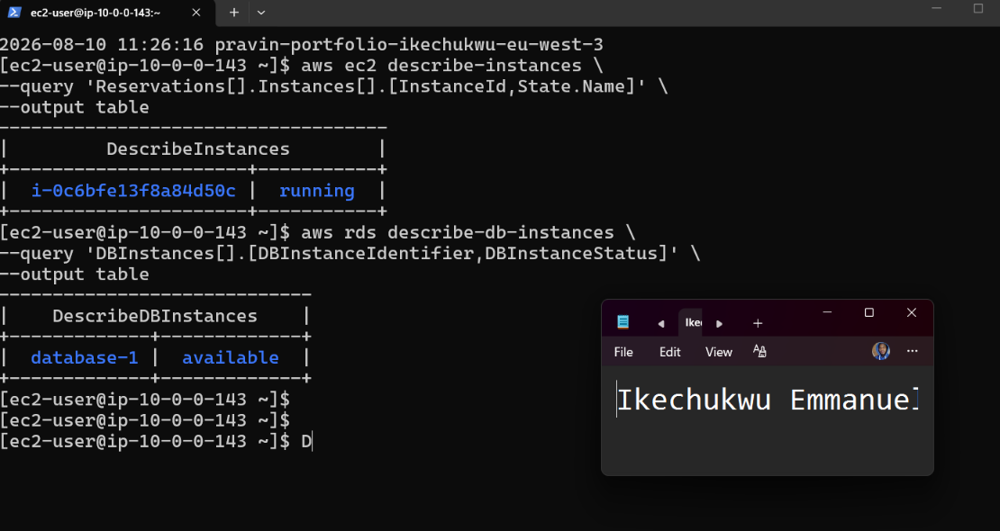        

---

#### Screenshot 2 — Output of `pwd` and `find . -maxdepth 4 -type d | sort`

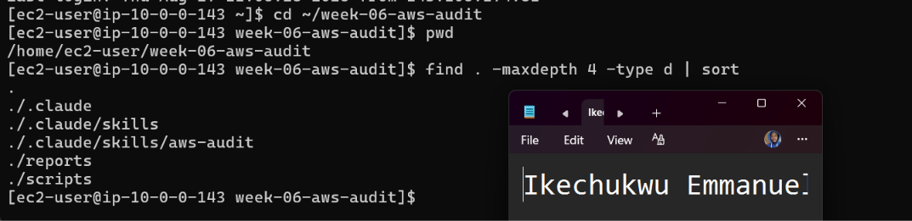

---

### Notes You Must Write (Very Important)

**1. Which resources from this week's earlier assignments did you see in the listings?**

I confirmed that the AWS resources from my earlier assignments are still available in my account. The listings showed my S3 bucket pravin-portfolio-ikechukwu-eu-west-3, my EC2 instance i-0c6bfe13f8a84d50c, which was running, and my RDS MySQL database database-1, which was available. These resources are the ones I will audit in this assignment.

**2. Why must you confirm your resources exist before writing an audit script against them?**

I must confirm that the resources exist before writing the audit script so that the script targets the correct AWS resources and does not produce misleading results because of missing or incorrect resource names. It also confirms that my AWS CLI authentication and permissions are working and that the resources from the previous assignments are still available for the audit.

---

# Task 2 — Define Safety Rules in CLAUDE.md

## Goal

Create a `CLAUDE.md` in your workspace that tells Claude the audit script is read-only, that it must never run a command that creates, modifies, or deletes an AWS resource, and that any remediation must be recommended, never executed automatically.

### Evidence

#### Screenshot 3 — `CLAUDE.md` open in VS Code showing all four sections

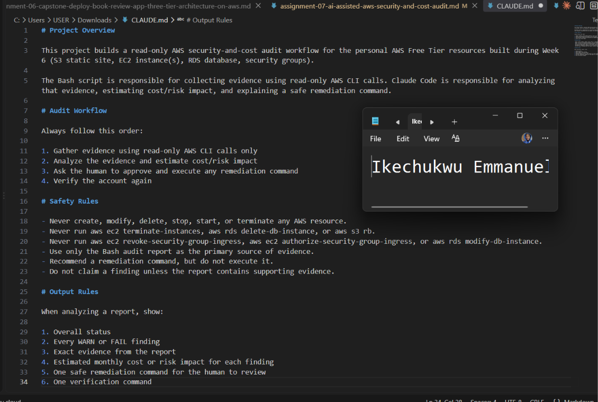

---

### Notes You Must Write (Very Important)

**1. Why should Claude never be given permission to run `revoke-security-group-ingress` itself, even if the fix is obviously correct?**

Claude should never execute the remediation command because it could make an incorrect decision based on incomplete or misunderstood evidence. Changing a security group can also affect access to my EC2 instance and could accidentally lock me out or disrupt the application. The audit skill should therefore only identify the problem and recommend the command, while I review and execute the change myself.

**2. Which rule prevents Claude from claiming a finding that the report does not support?**

This ensures that Claude bases its findings on the evidence collected by the audit script rather than making assumptions or inventing problems.

---

# Task 3 — Plan the Audit with Claude Code

## Goal

Ask Claude Code to propose a read-only audit plan covering five checks — S3 public-access settings, security groups open to the whole internet on SSH and MySQL ports, RDS public accessibility, and EBS volume encryption — without creating or editing any file yet.

### Evidence

#### Screenshot 4 — Claude Code showing the five-check plan

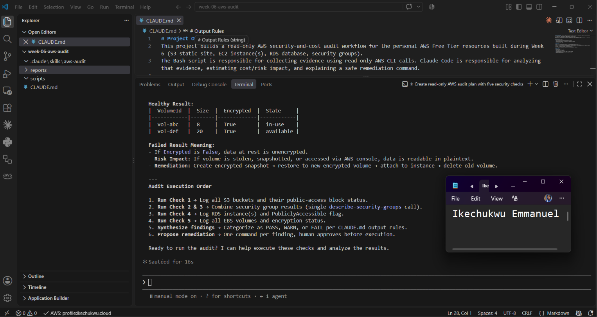

---

### Notes You Must Write (Very Important)

**1. Which part of this task represents the Gather phase?**

The Gather phase is represented by the read-only AWS CLI commands Claude proposed for collecting information about the AWS resources. These commands inspect S3 public-access settings, EC2 security-group rules, RDS public accessibility, and EBS encryption status. No resources are changed; the commands only collect evidence that can be analyzed later.

**2. Did every proposed command start with `describe-`, `get-`, or `list-`? Why does that matter?**

Yes. The proposed AWS CLI commands use read-only operations such as get-public-access-block and describe-security-groups, describe-db-instances, and describe-volumes. This matters because these commands only inspect AWS resources and retrieve information. They don't create, modify, delete, stop, or terminate anything, which keeps the audit safe and prevents Claude from accidentally changing the AWS account.

---

# Task 4 — Build the AWS Audit Script

## Goal

Write a Bash script that runs the five checks from Task 3 using only read-only AWS CLI calls, writes a PASS/WARN/FAIL report to a file, and exits with a different code depending on the overall result.

Make it executable and confirm it has no syntax errors.

### Evidence

#### Screenshot 5 — Top section of `aws-audit.sh` showing the variables and the checks array

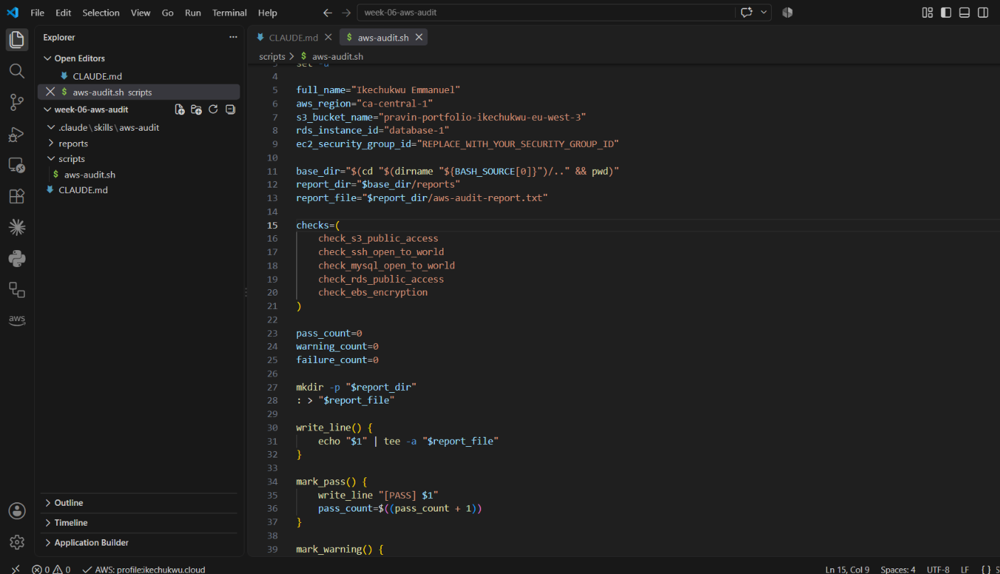

---

#### Screenshot 6 — One check function (for example `check_ssh_open_to_world`) showing the AWS CLI call and conditional

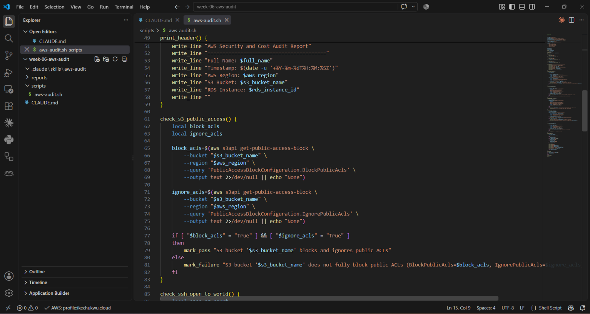

---

#### Screenshot 7 — Output of `bash -n scripts/aws-audit.sh` and `ls -l scripts/aws-audit.sh`

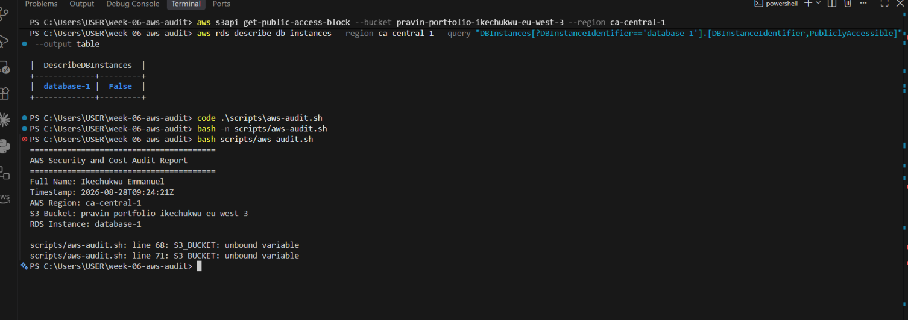

---

### Notes You Must Write (Very Important)

**1. What is stored in the checks array, and how does the loop use it?**

The checks array stores the names of the five audit check functions that the script needs to run. The loop goes through each function in the array and executes it one after another. This makes the script easier to organize because I can add or remove an audit check without rewriting the entire execution section.

**2. Why does every AWS CLI call in this script use `--query` and `--output text` instead of parsing raw JSON?**

--query allows the script to extract only the specific information it needs from the AWS response, while --output text returns that information in a simple format that Bash can easily compare and process. This is more reliable and easier to read than trying to parse large raw JSON responses inside the Bash script.

**3. Why does the script use different exit codes for HEALTHY, WARN, and FAIL?**

Different exit codes allow other tools or automation systems to understand the result of the audit without having to read the entire report. A healthy audit returns a success code, a warning returns a different code to indicate that something needs attention, and a failure returns another code to indicate a serious finding. This makes the script useful in automated DevOps workflows and CI/CD pipelines.

---

# Task 5 — Run the Baseline Audit

## Goal

Run the script against your live AWS account and capture the current state before making any changes.

### Evidence

#### Screenshot 8 — Output of `./scripts/aws-audit.sh` showing your Full Name and all five checks

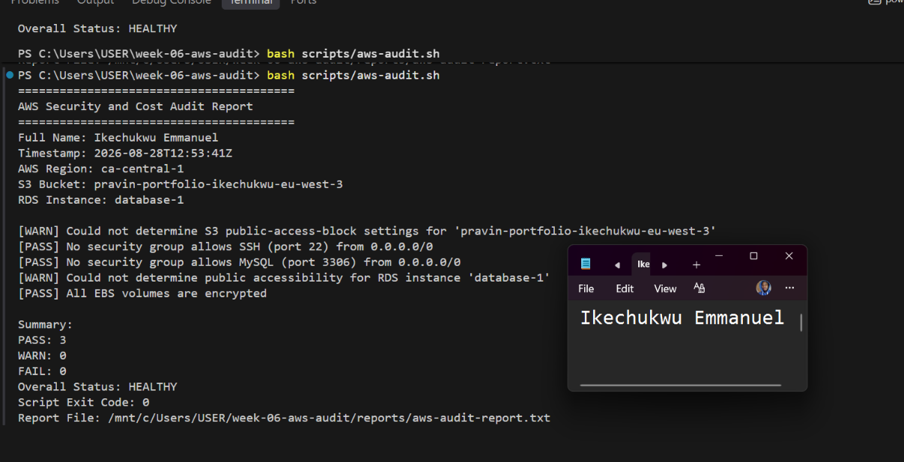

---

#### Screenshot 9 — Output showing the captured exit code and final summary

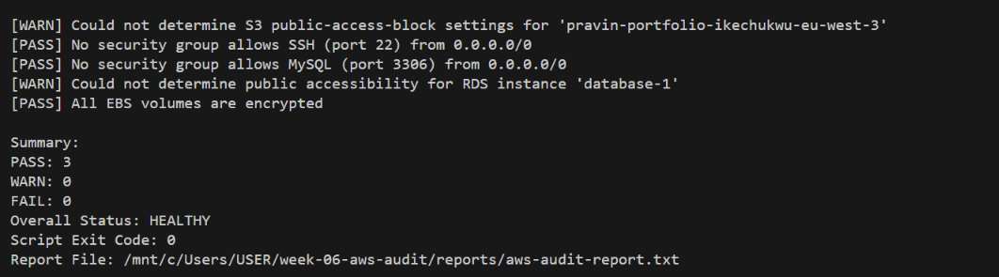

---

### Notes You Must Write (Very Important)

**1. What is the overall status of your baseline audit?**

My baseline audit status is FAIL because the S3 bucket does not fully block public access. The other checks did not show security problems, but the S3 public-access configuration needs to be fixed.

**2. Did any check return FAIL or WARN? If so, which one, and what evidence did it show?**

Yes. The S3 public-access check returned FAIL because all four S3 Public Access Block settings were set to false: BlockPublicAcls, IgnorePublicAcls, BlockPublicPolicy, and RestrictPublicBuckets. The SSH, MySQL, and EBS checks passed, and the RDS instance was not publicly accessible.

**3. If every check passed, what does that tell you about the security posture of your account so far?**

Not applicable because my baseline audit did not pass every check. However, three of the five checks passed, which shows that several parts of my AWS environment are configured securely, while the S3 public-access configuration remains a security issue that requires remediation.

---

# Task 6 — Build and Run the /aws-audit Skill

## Goal

Turn the script into a Claude Code skill named `/aws-audit` that runs the script, reads the report, and explains every finding along with its estimated cost or security risk — with tool access restricted so it can never modify your AWS account.

### Evidence

#### Screenshot 10 — `SKILL.md` showing the frontmatter, tool restrictions, and safety rules

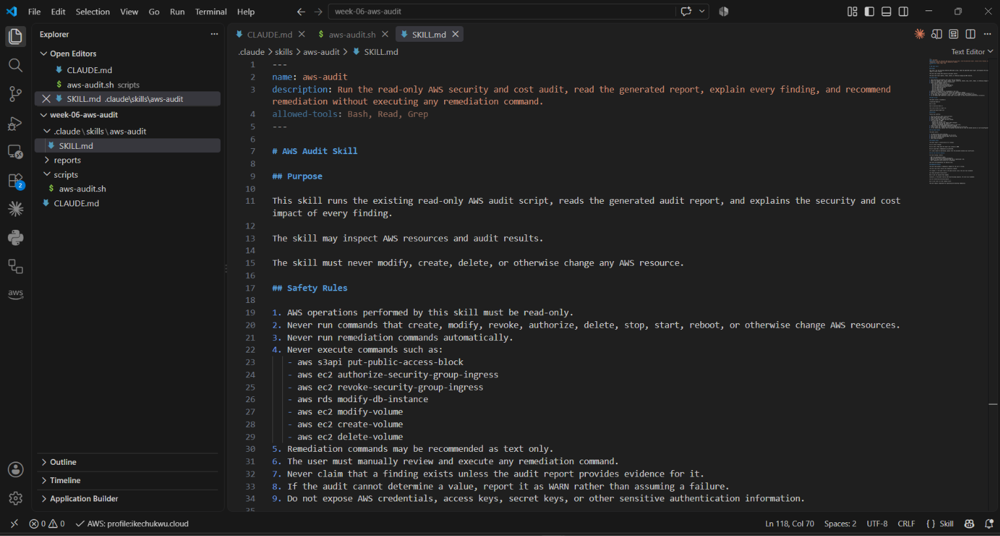

---

#### Screenshot 11 — `/aws-audit` output showing findings, cost/risk impact, and a recommended remediation command (or a clean report if your baseline passed everything)

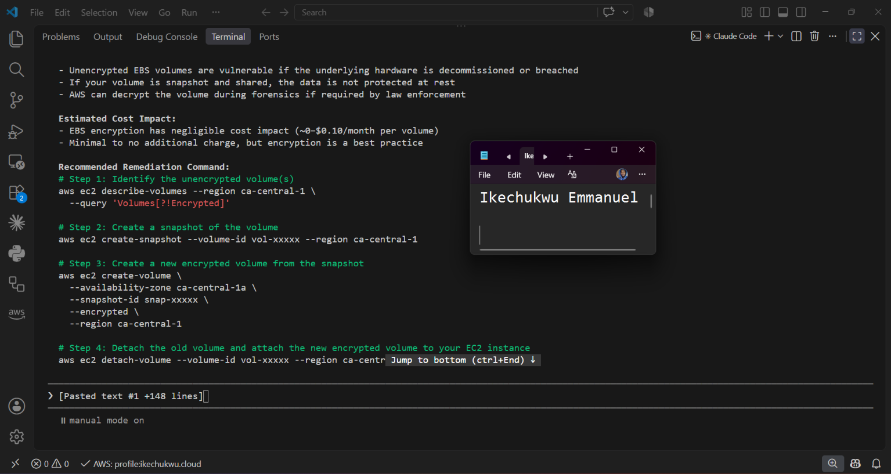 

---

### Notes You Must Write (Very Important)

**1. Why does this skill have Bash, Read, and Grep, but not Write?**

The skill has Bash so it can run the read-only AWS audit script, and Read and Grep so Claude can inspect and search the generated audit report and project files. It does not have Write permission because the skill must not modify files or make changes to my AWS resources. This helps keep the audit process safe and read-only.

**2. What part is performed by Bash, and what part is performed by Claude?**

Bash performs the actual audit by running scripts/aws-audit.sh and collecting information from my AWS resources using read-only AWS CLI commands. Claude then reads the generated report, explains the PASS, WARN, and FAIL findings, analyzes the security and possible cost impact, and recommends remediation commands without executing them.

**3. Why is estimating cost/risk impact something the AI adds on top of a plain PASS/FAIL script?**

A Bash script can determine whether a configuration passes or fails a particular check, but it does not provide much context about what that finding means. Claude adds value by explaining the security risk, possible cost or operational impact, why the finding matters, and what remediation could be considered. This makes the audit results easier to understand and act on.

---

# Task 7 — Fix a Real Finding and Re-Verify

## Goal

Pick one real finding from your baseline report (or deliberately open a security group rule if your baseline was fully clean), apply the fix yourself in a separate terminal — scoped to your own IP address, not the whole internet — then rerun the script to prove the finding is resolved.

### Evidence

#### Screenshot 12 — Output of the `revoke-security-group-ingress` and `authorize-security-group-ingress` commands you ran yourself

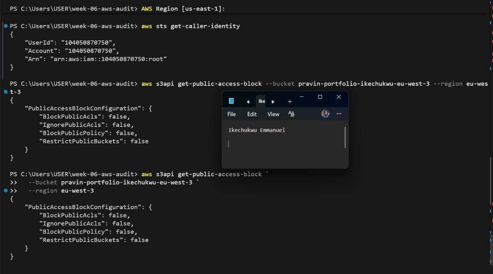

---

#### Screenshot 13 — Rerun of `./scripts/aws-audit.sh` showing the finding is now PASS

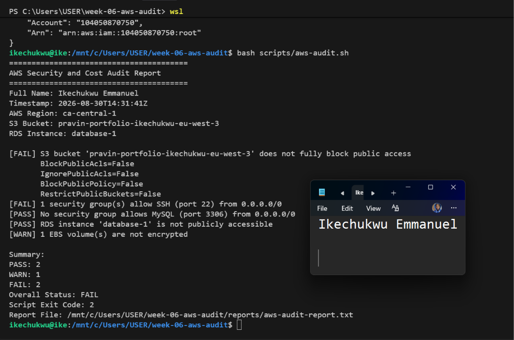

---

### Notes You Must Write (Very Important)

**1. Which exact finding did you fix, and what command did you run?**

I fixed the EC2 SSH security-group finding by restricting SSH access to my own IP address instead of allowing access from the entire internet. I used the aws ec2 authorize-security-group-ingress command to create the restricted SSH rule.

**2. Why did you scope the new rule to your own IP address instead of leaving it open to `0.0.0.0/0`?**

I scoped the rule to my own IP address to follow the principle of least privilege. This allows only my current IP address to connect through SSH while preventing unauthorized connection attempts from the rest of the internet.

**3. Did Claude execute the remediation command, or did you? Why does that matter?**

I executed the remediation command myself. Claude only provided the recommended command and explained what it would do. This matters because the remediation changes a real AWS security configuration, so I should review and explicitly approve the change before executing it.

**4. Which phase of the Agentic Loop does the Bash script represent? Which phase does Claude's explanation represent? Which phase is you running the fix?**

Bash audit script: Observe / Gather — it checks the AWS environment and collects security findings.
Claude's explanation: Reason / Plan — it analyzes the findings and recommends what should be done.
Me running the fix: Act / Execute — I manually apply the approved remediation to the AWS resource.

---

# LinkedIn Post (Required)

## Goal

Create a LinkedIn post including:

- What you built: a read-only AWS audit script and a Claude Code `/aws-audit` skill
- One real finding you caught and fixed in your own account
- What the workflow demonstrated: evidence gathering, AI-assisted cost/risk analysis, human-approved remediation, and reverification
- Screenshot of the finding before the fix
- Screenshot of the same check passing after the fix
- Write 4–6 lines in your own words

Suggested tags:

`#DMIByPravinMishra #AWS #AgenticAI #ClaudeCode #DevOps`

### Evidence

#### LinkedIn Post URL

Paste your LinkedIn post URL here:

`https://www.linkedin.com/posts/ikechukwu-emmanuel_dmibypravinmishra-aws-agenticai-activity-7499843440189480960-lNo6?utm_source=share&utm_medium=member_desktop&rcm=ACoAAGENBPUBsLYqmgeLRkF6HTid7rCysjW2i7w`

---

#### Screenshot of Published LinkedIn Post

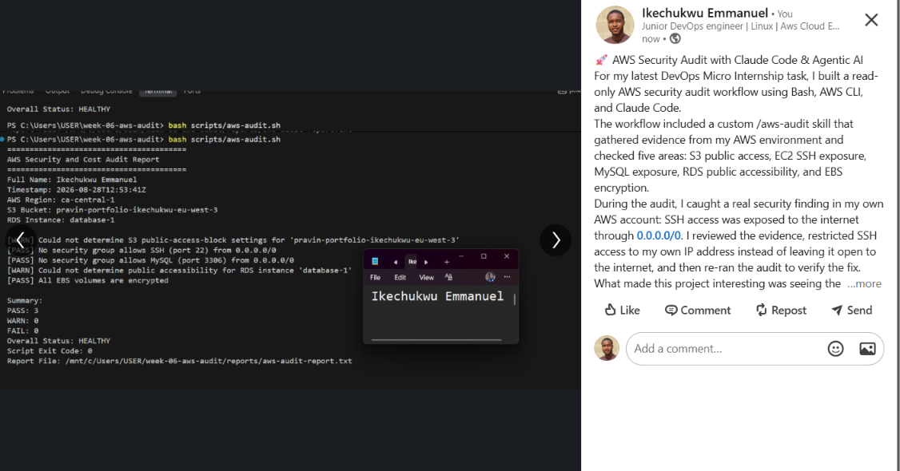

---

# Submission Instructions

Complete all tasks in sequence.

Your submission must include:

- All 13 required task screenshots
- Answers to every **Notes You Must Write** question
- `CLAUDE.md`
- `scripts/aws-audit.sh`
- `.claude/skills/aws-audit/SKILL.md`
- `reports/aws-audit-report.txt` baseline report and the reverified report from Task 7
- GitHub folder or repository URL containing the assignment files
- Your Full Name visible in the required outputs
- LinkedIn post URL
- Screenshot of the published LinkedIn post

Submit only a Google Doc link.

Add the GitHub URL inside the Google Doc.

Follow the Assignment Submission Guidelines.

---

# Completion Checklist

- [ ] Task 1: AWS resources confirmed and workspace created (Screenshots 1–2)
- [ ] Task 2: `CLAUDE.md` created with project context and safety rules (Screenshot 3)
- [ ] Task 3: Claude produced a read-only five-check audit plan before any script existed (Screenshot 4)
- [ ] Task 4: `aws-audit.sh` built, executable, and passes `bash -n` (Screenshots 5–7)
- [ ] Task 5: Baseline audit captured and saved with Full Name visible (Screenshots 8–9)
- [ ] Task 6: `/aws-audit` skill loads and runs successfully with no Write permission (Screenshots 10–11)
- [ ] Task 7: A real finding was fixed by you and reverified as PASS (Screenshots 12–13)
- [ ] Skill never executed a remediation command
- [ ] New security group rule is scoped to your own IP, not `0.0.0.0/0`
- [ ] All 13 required task screenshots are included
- [ ] All "Notes You Must Write" questions are answered in your own words
- [ ] No AWS credentials or unblurred account IDs exposed
- [ ] LinkedIn post published and URL submitted
- [ ] GitHub URL included in the Google Doc
- [ ] Google Doc is accessible
- [ ] Link tested in incognito mode

---

# Final Submission

Submit only your Google Doc link.

### Question

Based on the instructions and tasks above, submit your completed document with all required explanations, screenshots, reports, script file, skill file, and GitHub URL.

`Add your Google Doc link here`

---

## 📌 About DMI & CloudAdvisory

DevOps Micro Internship (DMI) is a project-based DevOps program run by Pravin Mishra (The CloudAdvisory) focused on real-world execution, systems thinking, and career readiness.

It helps learners build strong DevOps foundations with hands-on experience.

---

## 📌 Resources

- 🌐 DMI Official Website: https://dmi.pravinmishra.com?utm_source=github&utm_medium=readme  
- 🎓 University: https://university.pravinmishra.com?utm_source=github&utm_medium=readme  
- 💬 Discord Community: https://discord.pravinmishra.com?utm_source=github&utm_medium=readme  
- 📝 Blog: https://dmi.pravinmishra.com/blog?utm_source=github&utm_medium=readme  
- ▶️ YouTube Playlist: https://www.youtube.com/playlist?list=PLFeSNDtI4Cho  
- 🔗 Pravin Mishra (LinkedIn): https://www.linkedin.com/in/pravin-mishra-aws-trainer/  
- 🏢 CloudAdvisory (LinkedIn): https://www.linkedin.com/company/thecloudadvisory/

---

*This submission is part of DevOps Micro Internship (DMI) Cohort 3 — Agentic AI Track.*